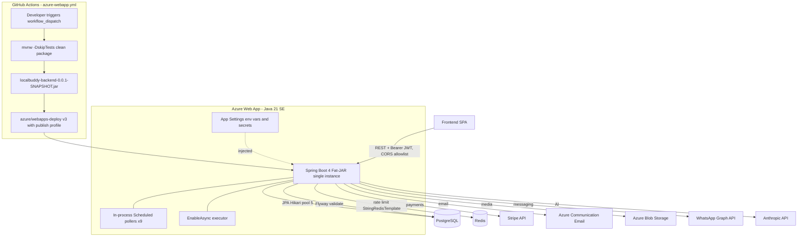
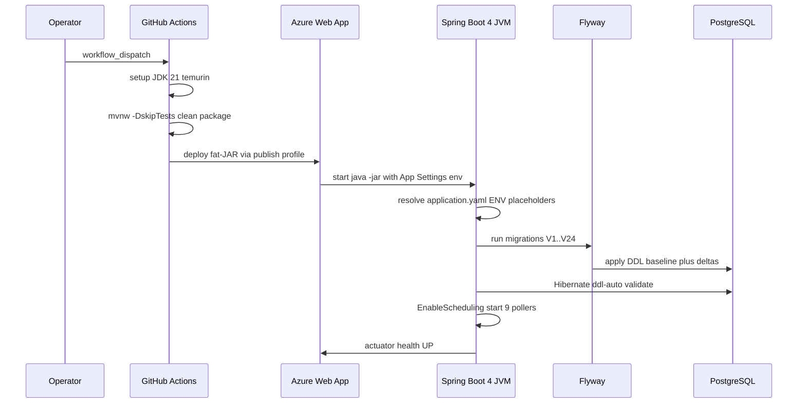
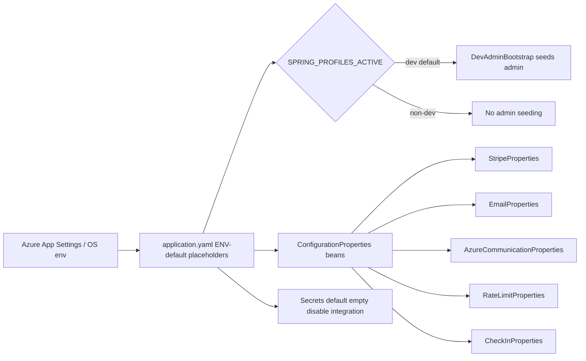
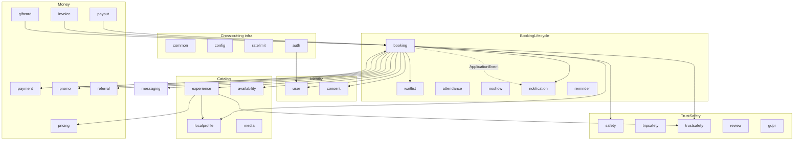
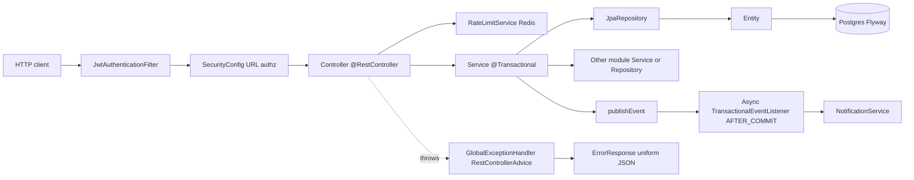
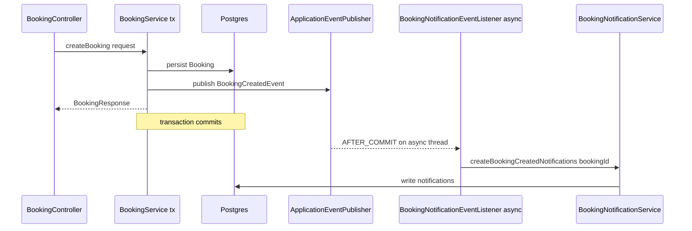

# System Architecture — Stack, Runtime & Modules

*LocalBuddy backend architecture · June 2026*

## Technology stack, runtime, build, deployment & configuration

> A single Spring Boot 4 / Java 21 fat-JAR monolith, built with Maven and deployed manually to an Azure Web App, configured entirely through environment variables with Postgres + Flyway for state and Redis for rate limiting.

### Lens summary

LocalBuddy's backend is a **single-deployable Spring Boot 4 monolith** targeting **Java 21**, built with **Maven** (via the committed `mvnw` wrapper) into one executable fat-JAR and shipped to an **Azure Web App** through a manually-triggered GitHub Actions workflow. State lives in **PostgreSQL** (schema managed by **Flyway** + validated by Hibernate); **Redis** backs only rate-limiting. Almost all configuration — including every secret — is supplied through **environment variables** consumed by a single `application.yaml`. The deployment unit is a plain JAR, not a container: there is **no `Dockerfile`, `docker-compose`, `Procfile`, or `web.config`** anywhere in the repo.

The codebase is sizable and feature-oriented: **538 Java source files** across ~40 top-level feature packages under `com.localbuddy` (e.g. `booking`, `payout`, `payment`, `giftcard`, `promo`, `attendance`, `notification`, `wallet`, `whatsapp`, `ai`).

---

### Technology stack inventory

#### Platform & language

| Concern | Choice | Source |
| --- | --- | --- |
| Language / level | Java 21 (`<java.version>21</java.version>`) | `pom.xml` |
| Framework | Spring Boot **4.0.6** (`spring-boot-starter-parent`) | `pom.xml` |
| Web layer | `spring-boot-starter-webmvc` (servlet MVC, not WebFlux) | `pom.xml` |
| Build | Maven + Maven Wrapper (`mvnw`, `.mvn/wrapper`) | repo root |
| Packaging | Executable fat-JAR via `spring-boot-maven-plugin` | `pom.xml` build |

> **Note — Spring Boot 4 specifics:** the dependency artifact names are the Boot 4 / Jakarta-era forms (`spring-boot-starter-webmvc`, `spring-boot-starter-flyway`, and the matching `*-test` starters), which differ from the Boot 3 names (`-web`, no dedicated flyway starter). This is a deliberately modern, early-adopter stack.

#### Core dependencies (from `pom.xml`)

| Capability | Artifact | Version |
| --- | --- | --- |
| Web MVC | `spring-boot-starter-webmvc` | (Boot-managed) |
| Persistence | `spring-boot-starter-data-jpa` (Hibernate) | (Boot-managed) |
| DB migrations | `spring-boot-starter-flyway` + `flyway-database-postgresql` | (Boot-managed) |
| Driver | `org.postgresql:postgresql` (runtime) | (Boot-managed) |
| Security | `spring-boot-starter-security` | (Boot-managed) |
| Validation | `spring-boot-starter-validation` | (Boot-managed) |
| Ops / health | `spring-boot-starter-actuator` | (Boot-managed) |
| Cache / rate-limit store | `spring-boot-starter-data-redis` | (Boot-managed) |
| JWT | `io.jsonwebtoken:jjwt-api/-impl/-jackson` | 0.12.6 |
| Payments | `com.stripe:stripe-java` | 32.1.0 |
| Email | `com.azure:azure-communication-email` | 1.0.23 |
| Media storage | `com.azure:azure-storage-blob` | 12.29.1 |
| PDF (invoices/tickets) | `com.openhtmltopdf:openhtmltopdf-pdfbox` | 1.0.10 |
| Crypto (Wallet passes) | `org.bouncycastle:bcpkix-jdk18on` | 1.78.1 |
| API docs | `org.springdoc:springdoc-openapi-starter-webmvc-ui` | 3.0.0 |
| Codegen | `org.projectlombok:lombok` (optional) | (Boot-managed) |
| Dev loop | `spring-boot-devtools` (runtime, optional) | (Boot-managed) |
| Kotlin stdlib | `kotlin-stdlib-jdk8` + `kotlin-maven-plugin` | 2.3.10 |

> **Kotlin trade-off / inconsistency:** the build wires a `kotlin-maven-plugin` (with `src/main/java` as a Kotlin sourceDir) and `kotlin-stdlib-jdk8`/`kotlin-test`, but the codebase is Java (Lombok-based). The Kotlin compiler is configured with `<jvmTarget>1.8</jvmTarget>` — far below the project's Java 21 — and the Lombok annotation processor is wired through `maven-compiler-plugin`. This dual-compiler setup is over-configured for a Java-only project and the 1.8 jvmTarget is a latent footgun if Kotlin code is ever added.

#### Application bootstrap (`LocalbuddyBackendApplication.java`)

A single `@SpringBootApplication` entry point. It additionally enables:
- `@EnableScheduling` — activates the in-process `@Scheduled` pollers.
- `@EnableConfigurationProperties({ StripeProperties, EmailProperties, AzureCommunicationProperties, RateLimitProperties, CheckInProperties })`.

> The file `com/localbuddy/giftcard/GiftCardApplication.java` is **not** a second Spring app — it is a `record GiftCardApplication(UUID, BigDecimal)` (a gift-card reservation value object). There is exactly **one** runtime entry point.

#### `config/` package

| Class | Role |
| --- | --- |
| `AsyncConfig` | `@EnableAsync` — enables `@Async` execution (used in 1 place; default `SimpleAsyncTaskExecutor`, no custom pool defined) |
| `RedisConfig` | Exposes a `StringRedisTemplate` bean over the auto-configured connection factory |
| `JacksonConfig` | JSON serialization config |
| `OpenApiConfig` | springdoc `OpenAPI` bean: title "LocalBuddy API" v1.0, `bearerAuth` HTTP/JWT security scheme for Swagger UI |
| `DevAdminBootstrap` | `@Profile("dev")` `CommandLineRunner` that seeds/repairs an ADMIN user at startup |

Cross-cutting config also lives outside this package — notably `auth/SecurityConfig` (stateless, `csrf.disable()`, `SessionCreationPolicy.STATELESS`, CORS from `app.cors.allowed-origins`, a `jwtAuthenticationFilter` added before `UsernamePasswordAuthenticationFilter`, with `/api/public/**` and `/api/auth/**` permitted).

---

### Runtime / process model

This is an **in-process, single-tier** runtime. There is no separate worker/scheduler service — scheduled and async work share the web process.

#### Scheduled background processors (9 `@Scheduled` pollers)

All use `fixedDelayString` bound to `app.*` keys (all overridable via env):

| Scheduler | Default delay | Config key |
| --- | --- | --- |
| `notification/NotificationProcessor` | 10 s | `app.notifications.processor-delay-ms` |
| `booking/BookingExpiryService` | 60 s | `app.booking.expiry-processor-delay-ms` |
| `booking/UnderbookedSlotService` | 300 s | `app.booking.underbooked-processor-delay-ms` |
| `noshow/BookingAutoCompletionService` | 300 s | `app.booking.auto-complete-processor-delay-ms` |
| `payout/HostLedgerService` | 300 s | `app.payout.ledger-release-delay-ms` |
| `notification/BookingReminderService` | 900 s | `app.notifications.reminder-processor-delay-ms` |
| `reminder/ReminderService` (×2 methods) | 1800 s | `app.reminders.processor-delay-ms` |
| `payout/PayoutScheduler` | 3600 s | `app.payout.processor-delay-ms` |
| `attendance/AttendanceService` (retention purge) | 86400 s | `app.checkin.retention-processor-delay-ms` |

> **Scaling trade-off:** because these run in every JVM and there is no leader election or distributed lock visible, **horizontal scale-out would double-fire** payouts, reminders, and expiry jobs. The current design is single-instance-safe only. The tiny Hikari pool (below) reinforces that the system is sized for one small instance.

#### Datasource / connection pool (`application.yaml`)

- `HikariCP` pool `LocalBuddyHikariPool`: `maximum-pool-size: 5`, `minimum-idle: 1`, `connection-timeout: 30000`, `idle-timeout: 300000`, `max-lifetime: 600000`, `keepalive-time: 300000`.
- JPA: `open-in-view: false`, `ddl-auto: validate`, `show-sql: false`, JDBC `time_zone: UTC`.

#### Redis

- `spring.data.redis` host/port/password from `REDIS_HOST/PORT/PASSWORD` (defaults `localhost:6379`), `timeout: 2000ms`.
- Used by `ratelimit/RateLimitService` (the only consumer of `StringRedisTemplate`). The **Redis health indicator is disabled** (`management.health.redis.enabled: false`) so Redis being down does not fail the actuator health probe — a deliberate availability choice.

#### Actuator / health

- Exposed web endpoints: **`health`, `info`** only. `endpoint.health.show-details: never` (no internals leaked). These are the natural Azure App Service health-probe targets.

#### Persistence & schema lifecycle (Flyway)

- `spring.flyway.enabled: true`, `locations: classpath:db/migration`, `baseline-on-migrate: true`.
- **24 migrations** `V1__baseline_schema.sql` … `V24__payment_gift_card.sql`. `V1` is a **consolidated baseline** (~30 `create table`) authored with the JPA `@Entity` classes as the declared source of truth; `ddl-auto: validate` must pass against it at boot.
- 5 `@ConfigurationProperties` records/classes: `CheckInProperties` (`app.checkin`), `EmailProperties` (`app.email`), `AzureCommunicationProperties` (`app.azure.communication`), `StripeProperties` (`app.payments.stripe`), `RateLimitProperties` (`app.rate-limit`).

> **Memory note (operational caveat, not in this repo's code):** the Supabase deployment requires Flyway pinned to the `public` schema (`currentSchema=public` + `SPRING_FLYWAY_SCHEMAS`). That pinning is **not** present in `application.yaml` and must be supplied via env on that target.

---

### Build & release pipeline

#### Local / CI build

- `./mvnw -B -ntp -DskipTests clean package` → produces `target/localbuddy-backend-0.0.1-SNAPSHOT.jar` (executable Spring Boot fat-JAR; Lombok excluded from the repackaged JAR).

#### CI/CD — `.github/workflows/azure-webapp.yml`

| Aspect | Value |
| --- | --- |
| Name | "Deploy to Azure Web App" |
| Trigger | `workflow_dispatch` only (push-to-`main` trigger is **commented out**) |
| Runner | `ubuntu-latest` |
| JDK | Temurin **21**, Maven cache enabled |
| Build step | `chmod +x ./mvnw && ./mvnw -B -ntp -DskipTests clean package` |
| Deploy step | `azure/webapps-deploy@v3` |
| App name | `AZURE_WEBAPP_NAME: localbuddy-backend` (env, hard-coded placeholder) |
| Artifact | `target/localbuddy-backend-0.0.1-SNAPSHOT.jar` |
| Auth | `secrets.AZURE_WEBAPP_PUBLISH_PROFILE` |

> **Release trade-offs:**
> - **Manual-only** (`workflow_dispatch`): no automatic deploy on merge; releases are operator-initiated. The header comment states this is intentional so feature pushes don't fail before Azure is wired up.
> - **Tests are skipped** in the deploy build (`-DskipTests`): the pipeline does **not** gate releases on the test suite, so quality gating depends entirely on developer discipline / a separate (not-present) CI run.
> - **Publish-profile auth** rather than OIDC federated credentials — simpler, but a long-lived secret.
> - No build-number/versioning beyond the static `0.0.1-SNAPSHOT`; the artifact path is hard-coded in the workflow, coupling it to that version string.

---

### Environment & secret configuration strategy

The strategy is **single-file, env-var-overridable, defaults-baked-in**. Every externalized value uses `${ENV_NAME:default}` in `application.yaml`. **Secrets default to empty strings**, so they must be injected as Azure App Settings (or local env) at runtime; the CI workflow injects only the publish profile, never runtime secrets.

#### Profiles
- `spring.profiles.active: ${SPRING_PROFILES_ACTIVE:dev}` — **default profile is `dev`**.
- **No** `application-<profile>.yaml` files exist. The only profile-gated bean is `DevAdminBootstrap` (`@Profile("dev")`). Production must set `SPRING_PROFILES_ACTIVE` to something other than `dev` to suppress admin seeding (otherwise an admin from `app.dev-admin.*`, default `admin@test.com` / `Password@123`, is created).

#### Configuration domains (all under `app.*` unless noted)

| Domain | Key prefix | Notable env vars / defaults |
| --- | --- | --- |
| Core infra | `spring.datasource` / `spring.data.redis` | `DB_URL`, `DB_USERNAME`, `DB_PASSWORD` (no defaults — **required**); `REDIS_HOST/PORT/PASSWORD` |
| Server | `server.port` | `SERVER_PORT:8080` |
| JWT / auth | `app.security.jwt` | `JWT_SECRET` (required), `JWT_ACCESS_TOKEN_EXPIRATION_MINUTES:15` |
| CORS / FE | `app.cors`, `app.frontend` | `CORS_ALLOWED_ORIGINS`, `FRONTEND_BASE_URL` (default `localhost:3000`) |
| Commission / fees | `app.platform`, `app.fees` | `commission-percentage:20`, `MAX_COMMISSION_RATE:0.50`, `SERVICE_FEE_PERCENTAGE:2.5` |
| Pricing age bands | `app.pricing.age-band` | adult/teen 1.0, child 0.5, infant 0.0 (env-overridable) |
| VAT | `app.vat` | `VAT_DEFAULT_COUNTRY:NL`, `VAT_STANDARD_RATE_PERCENTAGE:21`, `VAT_MERCHANT_OF_RECORD:INTERMEDIARY` |
| Payouts | `app.payout` | `PAYOUT_SCHEDULE:MONTHLY`, hold/min/day-of-month, processor delay |
| Booking lifecycle | `app.booking` | pending-payment expiry 15m, min-guests-to-confirm 3, underbooked + auto-complete windows |
| Notifications/reminders | `app.notifications`, `app.reminders` | reminder lead 24h, offsets `2,24,48`, max-age 72h |
| Geo check-in | `app.checkin` | geofence 300m, max-accuracy 500m, retention 90d |
| Payments (Stripe) | `app.payments.stripe` | `STRIPE_SECRET_KEY`, `STRIPE_WEBHOOK_SECRET`, success/cancel URLs |
| Email | `app.email`, `app.azure.communication` | `EMAIL_PROVIDER:console`, `AZURE_COMMUNICATION_CONNECTION_STRING` |
| Media | `app.media.azure` | blob connection-string, container `experience-photos`, public-base-url |
| WhatsApp | `app.whatsapp` | access-token, phone-number-id, Graph API base |
| Wallet passes | `app.wallet.google` / `.apple` | Google issuer/class/SA key; Apple pass-type/team/cert-base64/WWDR |
| Rate limit | `app.rate-limit.public-api` | enabled, 20 req / 60s window (Redis-backed) |
| Social login | `app.social.google` | `GOOGLE_CLIENT_ID` |
| AI | `app.ai.anthropic` | `ANTHROPIC_API_KEY`, model `claude-sonnet-4-6`, max-tokens 1024 |

> **"Feature flags":** there are no formal flag toggles beyond `app.rate-limit.public-api.enabled`. Other features are effectively **gated by whether their secret/connection-string is configured** (e.g. empty Stripe/Azure/WhatsApp/Wallet/Anthropic values disable those integrations). `app.email.provider` (`console` default) is a strategy selector rather than a boolean flag.
>
> **Trade-offs:** the all-in-one-file + env-default approach is simple and 12-factor-friendly, but (1) baking real-looking dev defaults (admin creds, `localhost` URLs) into the shipped artifact is risky if `SPRING_PROFILES_ACTIVE` is misconfigured; (2) there is no committed `.env.example` or per-profile file, so the full required-env contract is implicit in the YAML; (3) secrets rely entirely on the Azure App Settings plane (no Key Vault reference is wired in code).

---

### What is NOT in the code (explicit gaps)

- **No containerization** — no `Dockerfile`/`docker-compose`/`Procfile`/`web.config`. Azure runs the JAR directly (Java SE stack on App Service).
- **No `application-prod.yaml`** or any profile-specific override file.
- **No infrastructure-as-code** (no Bicep/Terraform/ARM templates in repo).
- **No external job queue / message broker** — async + scheduling are in-JVM.
- **No leader-election / distributed-lock** mechanism for the schedulers.
- **No Azure Key Vault** integration in code; secrets come from plain env/App Settings.

### Diagrams

#### Deployment & runtime topology



#### Build to boot sequence



#### Configuration resolution model



### Key architectural decisions & trade-offs

- Monolithic fat-JAR over containers: build produces a single executable Spring Boot JAR (localbuddy-backend-0.0.1-SNAPSHOT.jar) deployed directly to Azure Web App via azure/webapps-deploy; no Dockerfile or docker-compose exists in the repo.
- Spring Boot 4.0.6 on the bleeding edge (Jakarta EE, spring-boot-starter-webmvc/-flyway naming), pinning Java 21 as the language level but compiling Kotlin stdlib to an obsolete jvmTarget 1.8 — an inconsistency, though no Kotlin sources are actually present.
- Configuration is 100% environment-variable driven from a single application.yaml with inline ${ENV:default} placeholders; there are NO profile-specific YAML files (application-prod.yaml etc.). The only Spring profile in code is dev (default), which only gates DevAdminBootstrap seeding.
- Schema is owned by JPA entities and enforced at boot via spring.jpa.hibernate.ddl-auto: validate; Flyway (baseline-on-migrate true, V1..V24) applies the DDL. A consolidated V1 baseline was authored from the entities as source of truth.
- Secrets (JWT, Stripe, Azure, WhatsApp, Google/Apple Wallet, Anthropic) are externalized to env vars with empty-string defaults; the CI workflow only injects an Azure publish profile secret, so all runtime secrets must be set as Azure App Settings out-of-band.
- Background work runs in-process via Spring @Scheduled fixedDelay pollers (9 schedulers) plus @EnableAsync; there is no external job queue or worker tier, which couples scheduled processing to every running instance and is unsafe to scale horizontally without leader election.
- HikariCP pool is deliberately tiny (max 5, min-idle 1) — sized for a single small Azure instance and a constrained Postgres connection budget.
- CI/CD is intentionally manual (workflow_dispatch only, push trigger commented out) and deploys a tests-skipped artifact (mvnw -DskipTests clean package), so the pipeline does not gate releases on the test suite.


---

## Modular structure, layering & cross-cutting concerns

> A package-per-feature modular monolith (~44 domain packages, 87 controllers) on a strict controller to service to repository to entity layering, with conventions enforced only by discipline — no module-boundary tooling, URL-based authz, manual DTO mapping, and a thin set of global cross-cutting beans.

### Overview

LocalBuddy is a **modular monolith**: a single Spring Boot 3 / Java 21 deployable (`LocalbuddyBackendApplication`) whose code is decomposed into roughly **44 feature packages** directly under `com.localbuddy`. Each package is a self-contained vertical slice that owns its controllers, services, repositories, JPA entities, enums and DTOs. There is **no separate `web`, `service`, `dao` or `domain` top-level layer** — layering is expressed *within* each feature package by class role and suffix convention, not by package. The result is high feature cohesion at the cost of module boundaries that are enforced only by developer discipline.

Counts grounded in the code: 87 `@RestController` classes, 53 `@Entity` classes, 24 Flyway migrations (`V1`–`V24`), 60 classes carrying `@Transactional`, and 9 classes with `@Scheduled` methods.

### Module / package map

The packages group naturally into domains even though the code keeps them flat:

| Domain area | Packages |
|---|---|
| Identity & access | `auth`, `user`, `consent` |
| Catalog & supply | `experience`, `localprofile`, `availability`, `media`, `calendar` |
| Booking lifecycle | `booking`, `waitlist`, `attendance`, `noshow`, `reminder`, `notification` |
| Money | `payment`, `payout`, `pricing`, `promo`, `referral`, `giftcard`, `invoice`, `currency`, `deals` |
| Trust & safety | `safety`, `tripsafety`, `trustsafety`, `review`, `gdpr` |
| Comms & growth | `messaging`, `whatsapp`, `newsletter`, `announcement`, `wishlist`, `contact`, `ai`, `wallet` |
| Admin surfaces | `admin`, `adminops` |
| Cross-cutting / infra | `common`, `config`, `ratelimit`, `audit` (empty placeholder) |

A few naming overlaps are worth flagging to an architect: **safety is split across three packages** — `safety` (booking safety checklists + safety reports), `tripsafety` (SOS / emergency contacts / trip-check events) and `trustsafety` (account restrictions + a *second* `SafetyReport`/`CreateSafetyReportRequest`/`SafetyReportType` triad). The duplicated DTO/enum names across `safety` and `trustsafety` are a latent source of confusion and a candidate for consolidation. Similarly `admin` (per-domain admin controllers) and `adminops` (bulk seeding/ops) overlap conceptually.

The `common` and `config` packages are deliberately thin. `common` holds only `HealthController`, `GeoUtil`, and the `exception` subpackage; `config` holds five `@Configuration` classes. There is **no shared base entity** (`@MappedSuperclass` is absent), so id and timestamp fields are repeated per entity, and **no `package-info.java` boundary markers**.

### Layering convention

Every feature follows the same four-tier shape, identifiable purely by class-name suffix:

| Tier | Marker | Convention |
|---|---|---|
| Controller | `*Controller` + `@RestController` | Thin; binds HTTP, validates with `@Valid`, extracts the caller via an `Authentication` parameter, delegates to one service, returns `ResponseEntity<*Response>` |
| Service | `*Service` + `@Service` | Business logic + transaction boundary (`@Transactional`); orchestrates repositories and other services; throws `BadRequestException` / `ResourceNotFoundException` |
| Repository | `*Repository extends JpaRepository` | Spring Data; derived + `@Query` methods |
| Entity | `@Entity` (Lombok-annotated) | Maps to a Flyway-managed table |
| DTO | request `record`s + `*Response` `record`s | Keep entities off the wire |

**DTO mapping is hand-written**, not generated: response records expose static factory methods (the `public static XResponse from(...)` pattern, 12 found) and there is **no MapStruct dependency**. Entities are never returned directly from controllers. Validation is Jakarta Bean Validation on request DTOs (`spring-boot-starter-validation`), with a custom `@StrongPassword` constraint (`StrongPasswordValidator`) in `auth`.

`spring.jpa.open-in-view: false` is set, which is the correct choice for this style — it forces all lazy-loading to happen inside the service transaction and surfaces `LazyInitializationException` early rather than silently keeping sessions open through view rendering.

```
HTTP -> JwtAuthenticationFilter -> Controller(@Valid, Authentication) -> Service(@Transactional) -> Repository -> Entity/DB
                                                                              |-> other module Services / Repositories (in-process)
                                                                              |-> publishEvent -> @Async @TransactionalEventListener (notifications)
```

### Inter-module dependency direction

Modules integrate **in-process and synchronously** by directly injecting other modules' services *and repositories*. This is the most architecturally significant property of the codebase. The most-injected repositories across module boundaries are:

| Repository | Cross-module injections |
|---|---|
| `user.UserRepository` | 26 |
| `booking.BookingRepository` | 13 |
| `localprofile.LocalProfileRepository` | 11 |
| `experience.ExperienceRepository` | 6 |
| `availability.AvailabilitySlotRepository` | 5 |

`BookingService` is the **dependency hub** of the system: it imports types/beans from ~13 other modules — `availability`, `consent`, `experience`, `localprofile`, `messaging`, `notification`, `payment`, `promo`, `referral`, `safety`, `trustsafety`, `user`, `waitlist`. Because nothing prevents a module from reaching directly into another module's persistence layer, the encapsulation boundary is the package only by convention. With **no Spring Modulith, no ArchUnit, and no `package-info` allowed-dependency declarations**, there is no compile-time or test-time guard against cyclic or layering-violating dependencies. This is the principal trade-off of the current design: fast intra-process calls and simple transactions, but erosion-prone module seams.

The one place the system **decouples** modules is booking notifications: `BookingService` publishes a `BookingCreatedEvent` via `ApplicationEventPublisher`, and `BookingNotificationEventListener` consumes it with `@Async @TransactionalEventListener(phase = AFTER_COMMIT)` — so notification fan-out runs off the request thread and only after the booking transaction commits. This event-after-commit pattern is used narrowly (booking creation), not as a general integration backbone.

### Cross-cutting concerns

Cross-cutting concerns are implemented as a small, centralized set of beans rather than via AOP aspects:

- **Global error handling** — `common.exception.GlobalExceptionHandler` is the single `@RestControllerAdvice`. It maps `BadRequestException`→400, `ResourceNotFoundException`→404, `MethodArgumentNotValidException`/`ConstraintViolationException`→400 (concatenating field errors), `HttpMessageNotReadableException`→400 ("Invalid request body"), `NoResourceFoundException`/`NoHandlerFoundException`→404, and a catch-all `Exception`→500 ("An unexpected error occurred"). All responses share the uniform `ErrorResponse` record `(timestamp, status, error, message, path)`. Note the catch-all **swallows the real exception message** (good for not leaking internals, but pairs with no correlation id, so 500s are hard to trace).
- **Authentication** — `auth.JwtAuthenticationFilter` (a `OncePerRequestFilter` registered before `UsernamePasswordAuthenticationFilter`) parses the Bearer JWT, loads the `User`, and sets a `UsernamePasswordAuthenticationToken` whose principal name is the user UUID and whose single authority is `ROLE_<UserRole>`. JWT signing/parsing is in `JwtService` (jjwt). Sessions are `STATELESS`; CSRF/formLogin/httpBasic disabled.
- **Authorization** — coarse, URL-based in `SecurityConfig`: `permitAll` for `/api/health`, actuator health/info, swagger, `/api/auth/**`, `/api/public/**`, `/api/experience-categories/**`, `/api/cities/**`; `hasRole("ADMIN")` for `/api/users/**` and `/api/admin/**`; everything else `authenticated()`. There is **no method security** (`@PreAuthorize`/`@EnableMethodSecurity` absent); finer ownership/role checks live inside services. Handlers obtain the caller via an `Authentication` parameter and `UUID.fromString(authentication.getName())` (122 occurrences) — a repeated idiom with **no shared `@CurrentUser` resolver/helper**, which is a small DRY/abstraction gap.
- **Rate limiting** — `ratelimit.RateLimitService` uses a Redis `StringRedisTemplate` INCR + TTL window keyed `rate-limit:public:<key>`, configured by `RateLimitProperties` (`app.rate-limit.public-api.*`, default 20 req / 60 s). It is invoked explicitly by public controllers (not a filter) and **fails open** on any Redis error. `ClientIpResolver` derives the client key.
- **Async & scheduling** — `config.AsyncConfig` (`@EnableAsync`) and `@EnableScheduling` on the application class. Nine `@Scheduled` services drive the temporal backbone: `BookingExpiryService`, `UnderbookedSlotService`, `BookingAutoCompletionService`, `AttendanceService` (retention), `BookingReminderService`, `NotificationProcessor` (outbox-style dispatch), `HostLedgerService`, `PayoutScheduler`, `ReminderService`. **No custom `TaskExecutor`/`TaskScheduler` bean is defined**, so async and scheduling run on Spring's default pools — a scaling caveat in a single instance.
- **Typed configuration** — `@EnableConfigurationProperties` registers `StripeProperties`, `EmailProperties`, `AzureCommunicationProperties`, `RateLimitProperties`, `CheckInProperties`; the rest of `application.yaml` (extensive `app.*` tree for pricing, VAT, payout, reminders, checkin, wallet, AI, etc.) is read via `@Value`/`@ConfigurationProperties` per module.
- **Serialization** — `JacksonConfig` exposes a single shared `ObjectMapper` (`@ConditionalOnMissingBean`, `findAndRegisterModules()`), explicitly added because some beans inject `ObjectMapper` directly and the web starter doesn't register one.
- **External-integration adapter pattern** — providers are abstracted behind interfaces with swappable implementations selected by config, e.g. `MediaStorageProvider`→`AzureBlobStorageProvider`, `EmailProviderService`→`AzureEmailProviderService`/`ConsoleEmailProviderService` (`app.email.provider`), `PaymentCheckoutProvider`→`StripePaymentCheckoutProvider`, `ConnectPayoutProvider`→`StripeConnectPayoutProvider`, `ExchangeRateProvider`→`FrankfurterExchangeRateProvider`, `SocialTokenVerifier`→`Google/FacebookTokenVerifier`. This is the one place where clean ports-and-adapters discipline is consistently applied.

### Audit — gap

The dedicated `audit/` package contains only a `.gitkeep` — **there is no cross-cutting audit framework** (no `@EntityListeners`, no global audit advice). Auditing exists only locally and inconsistently, e.g. `pricing.RateChangeAudit` + `RateChangeAuditRepository` for rate-admin changes. For a marketplace handling money and GDPR, the absence of a uniform audit trail is a notable architectural gap.

### API & versioning conventions

- **Audience-by-prefix, not version-by-path.** The API is segmented by caller type using path prefixes: `/api/public/**` (open, rate-limited; e.g. `PublicExperienceController`, `PublicGiftCardController`, `PublicGuestBookingController`, plus the Stripe webhook at `/api/public/payments/webhooks/stripe`), `/api/admin/**` (28 controllers, ROLE_ADMIN), `/api/host/**`, and authenticated `/api/**`. Guest (unauthenticated buyer) flows are mirrored as `Public*` controllers alongside their authenticated counterparts (e.g. `BookingController` vs `PublicGuestBookingController`).
- **No version segment** (`/v1`, header versioning, or media-type versioning) exists. With an OpenAPI spec advertised at version "1.0" (`OpenApiConfig`) but no URL versioning, breaking changes have no migration path — an explicit trade-off/gap.
- OpenAPI/Swagger is wired via `springdoc-openapi-starter-webmvc-ui` with a global `bearerAuth` security scheme.

### Persistence & migration conventions

Schema is **owned by Flyway** (`src/main/resources/db/migration`, `V1`–`V24`, `baseline-on-migrate: true`) and Hibernate runs with `ddl-auto: validate`, so the DB is the source of truth and entities must match. Entity relationship modeling is **mixed**: 32 entities use JPA `@ManyToOne(fetch = LAZY)` + `@JoinColumn` associations (e.g. `Booking` maps `traveler_user_id`, `local_profile_id`, `experience_id`, `availability_slot_id`, `promo_code_id`, `referral_code_id`), while other entities store **raw `UUID` FK columns** without a mapped association — a deliberate loose-coupling lever between modules, but one that makes the object graph inconsistent and bypasses referential navigation. Per the memory note, future Supabase migrations must pin Flyway to the `public` schema.

### Build, CI & deployment shape

Single Maven module (`spring-boot-starter-parent`), Java 21, Lombok, key starters: `data-jpa`, `data-redis`, `security`, `validation`, `webmvc`, `actuator`, plus `flyway-database-postgresql`, `jjwt-*`, `stripe-java`, `azure-storage-blob`, `azure-communication-email`, `springdoc`. CI is a **single workflow** `.github/workflows/azure-webapp.yml` (`workflow_dispatch` only — push trigger commented out) that builds with `-DskipTests` and deploys the jar to Azure Web App via publish profile. There is **no CI test/lint/arch-check gate**, which reinforces that module boundaries and layering are unverified by automation. Tests exist (`src/test/java/com/localbuddy/{booking,pricing,payout,promo,giftcard,invoice,attendance,finance,...}`) but run only locally.

### Key trade-offs summary

| Decision | Benefit | Cost / risk |
|---|---|---|
| Modular monolith, package-per-feature | High cohesion, simple deploy, simple transactions | Boundaries unenforced; `BookingService` hub coupling |
| Direct cross-module service+repo injection | Fast, transactional, no serialization | Encapsulation erosion; refactors ripple widely |
| No Spring Modulith / ArchUnit / package-info | Zero ceremony | No guard against cyclic/illegal deps |
| URL-based authz + in-service ownership checks | Simple filter chain | Scattered checks, repeated `authentication.getName()` idiom, IDOR risk (see SUPPORT booking-read note) |
| Manual DTO mapping (no MapStruct) | Explicit, debuggable | Boilerplate, drift risk |
| Prefix-based API segmentation, no versioning | Simple routing | No breaking-change migration path |
| Empty `audit` package | — | No uniform audit trail for money/GDPR |
| Default async/scheduler pools | Less config | Single-instance scaling ceiling |

### Diagrams

#### Module map and dependency directions (modular monolith)



#### Layering and request flow with cross-cutting concerns



#### Booking-created notification: event-after-commit decoupling



### Key architectural decisions & trade-offs

- Modular monolith with package-per-feature (~44 packages under com.localbuddy), each owning its full vertical stack — but module boundaries are convention-only: no Spring Modulith, no ArchUnit, no package-info markers, so any service can inject any other module's repository.
- Strict 4-tier layering: @RestController -> @Service (@Transactional) -> Spring Data JpaRepository -> JPA @Entity. DTOs (request records + *Response records) keep entities off the wire; mapping is hand-written via static Response.from(...) factories (12 found) — no MapStruct.
- API surface is segmented by audience via path prefix rather than versioning: /api/public/** (unauthenticated, rate-limited), /api/admin/** (ROLE_ADMIN), /api/host/**, and authenticated /api/**. No version segment (no /v1) — versioning is an explicit gap.
- Authorization is coarse URL-based matching in SecurityConfig plus per-handler Authentication params (122 occurrences of UUID.fromString(authentication.getName())). No @PreAuthorize / method security; ownership checks live inside services.
- Cross-cutting concerns are centralized as a few beans: one @RestControllerAdvice (GlobalExceptionHandler) emitting a uniform ErrorResponse, a stateless JwtAuthenticationFilter, a Redis-backed RateLimitService that fails open, @EnableAsync + @EnableScheduling, and @ConfigurationProperties for typed config.
- Inter-module integration is in-process and synchronous (direct service/repository calls), with BookingService as the dependency hub (~13 modules). The only decoupled path is booking notifications via a Spring ApplicationEvent consumed by an @Async @TransactionalEventListener AFTER_COMMIT.
- The audit/ package is an empty .gitkeep placeholder — there is no global audit framework; auditing is local and ad hoc (e.g. pricing/RateChangeAudit only).
- Schema is owned by Flyway (24 V-migrations, ddl-auto=validate); entities mix JPA @ManyToOne associations (32 entities) with raw UUID FK columns, and there is no @MappedSuperclass base entity for common id/timestamp fields.


---


[← back to the architecture index](./README.md)
