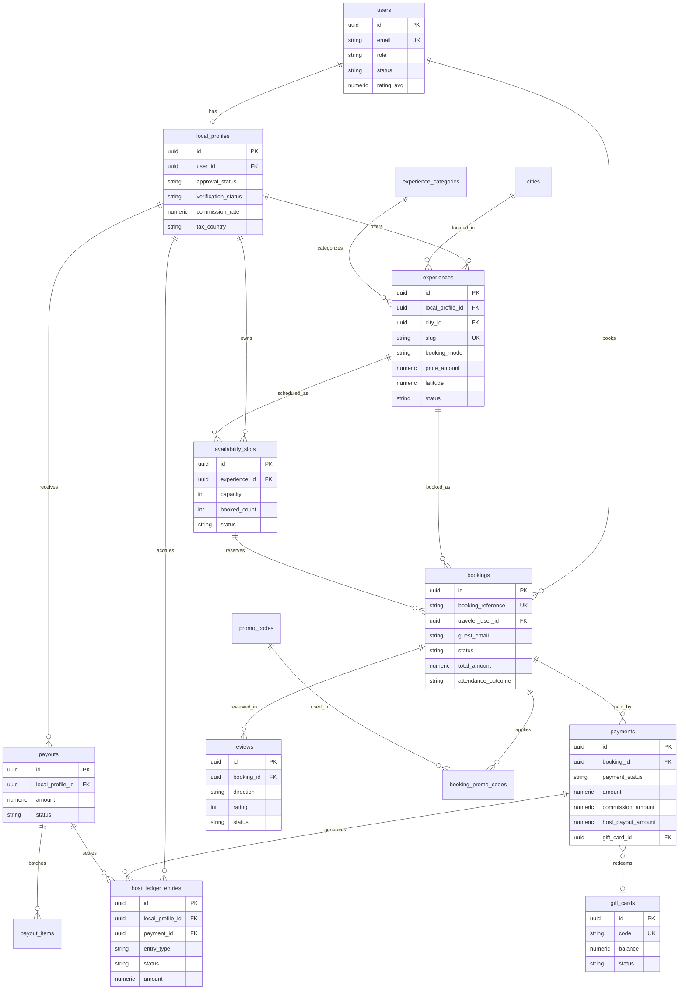
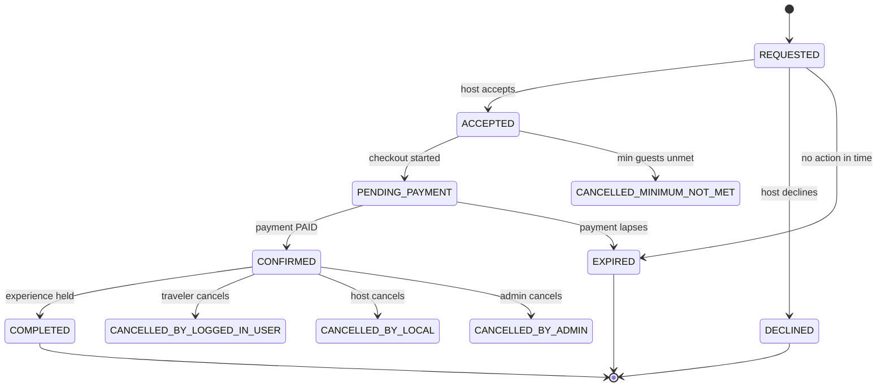
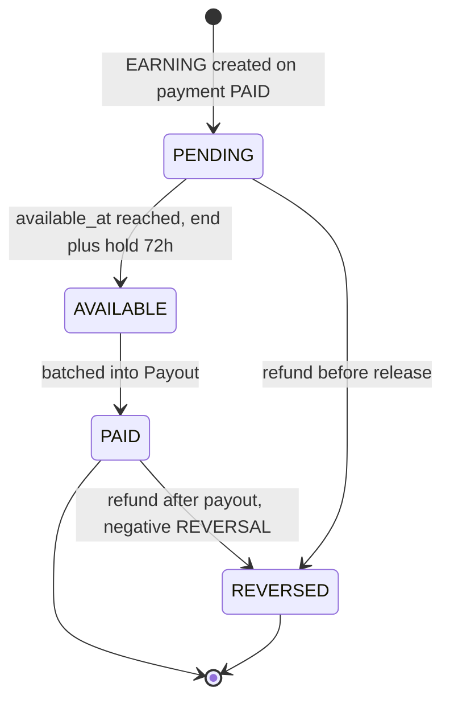
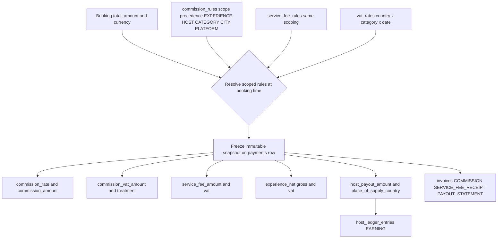

# Data Architecture & Domain Model

*LocalBuddy backend architecture · June 2026*

## Data architecture, domain model & persistence

> A code-first JPA domain (53 @Entity classes, ~50 tables) over PostgreSQL with a Flyway-managed schema validated by Hibernate, UUID surrogate keys, string-stored enums, an immutable per-transaction financial snapshot + append-only host ledger, and consent/event tables instead of true soft-delete.

### Overview

LocalBuddy uses a **code-first JPA domain model** as the single source of truth for its relational schema. There are **53 `@Entity` classes** under `com.localbuddy.**` mapping to **~50 physical tables** (a handful of entities share helper/sequence tables and there are pure join tables). Persistence is PostgreSQL via the `postgresql` JDBC driver; schema lifecycle is owned by **Flyway** (`flyway-database-postgresql`), and Hibernate runs in **validate-only** mode.

Key persistence configuration (`src/main/resources/application.yaml`):

| Setting | Value | Consequence |
|---|---|---|
| `spring.jpa.hibernate.ddl-auto` | `validate` | Hibernate never mutates the schema; it asserts the entities match the Flyway-built schema at boot. |
| `spring.jpa.open-in-view` | `false` | No OSIV; lazy associations must be fetched inside the service/transaction boundary. |
| `spring.jpa.properties.hibernate.jdbc.time_zone` | `UTC` | All `Instant`/`TIMESTAMPTZ` round-trips normalized to UTC. |
| `spring.flyway.enabled` / `locations` | `true` / `classpath:db/migration` | Migrations `V1`..`V24` applied in order. |
| `spring.flyway.baseline-on-migrate` | `true` | Allows adopting an existing DB at baseline. |

### Schema authority model — "entity wins"

The migration set is unusual and worth calling out for an architect: **`V1__baseline_schema.sql` is a consolidated 1,205-line baseline** that *reproduces the final merged schema regenerated from the `@Entity` classes* (it references the historical `V1..V32` only for non-entity artifacts like `audit_logs`, CHECK constraints, FK on-delete behavior, and seed data). `V2`..`V24` are then **forward deltas layered on top of that baseline**.

The baseline's stated acceptance criterion is that `ddl-auto: validate` passes against it, and **where an entity and the old migrations disagreed, the entity wins** (annotated inline as `ENTITY-WINS:`). Concrete examples found in `V1`:

- `reviews.booking_id` was `UNIQUE` in the old `V10`; the entity maps it as a plain `@ManyToOne`, so uniqueness was **intentionally dropped** to allow bidirectional reviews (traveler→host and host→traveler rows per booking).
- `experience_category_links`, `conversations`, `messages`, and `deals` have **no historical migration at all** — they were created purely from entity mappings.
- `local_profiles.bio` / `profile_photo_url` were created nullable historically but are `NOT NULL` on the entity, so the baseline enforces `NOT NULL`.

> Trade-off: this gives a clean single-file baseline and guarantees entity/schema parity, but it means the migration history is **not a faithful replay** of how production evolved — `V1` is a snapshot, and reviewers must read the entities, not just the SQL, to know intent.

### JPA mapping strategy

Conventions are highly uniform across entities:

- **Identity:** `@Id @GeneratedValue(strategy = GenerationType.UUID)` with `@Column(name="id", updatable=false, nullable=false)`, defaulted in SQL to `gen_random_uuid()` (the `pgcrypto` extension is created first in `V1`).
  - **Application-assigned / natural keys (exceptions):** `CancellationRefundPolicy` (UUID, *no* `@GeneratedValue` — seeded with fixed UUIDs), `BookingReferenceSequence` (PK `booking_date LocalDate`), and `InvoiceSequence` (PK `year INTEGER`). These two sequence tables back per-day booking references and per-year invoice numbering respectively.
- **Lombok** `@Getter/@Setter/@NoArgsConstructor` on every entity; no business logic in entities beyond `@PrePersist`/`@PreUpdate` lifecycle hooks that stamp `createdAt`/`updatedAt` (`Instant`) and apply enum/collection defaults defensively.
- **Associations are `FetchType.LAZY` by default** (consistent with `open-in-view=false`). `@ManyToOne` joins use explicit `@JoinColumn`. `LocalProfile`→`User` is a `@OneToOne(LAZY)` on a `UNIQUE` FK.
- **Many-to-many via `@JoinTable`:** `LocalProfile.experienceCities`/`experienceCategories` (`local_profile_experience_cities`, `local_profile_experience_categories`) and `Experience.categories` (`experience_category_links`).
- **JSON columns:** `LocalProfile.experienceLanguages` is `@JdbcTypeCode(SqlTypes.JSON)` mapped to `jsonb`. Other JSONB usage is in audit tables (`audit_logs.old_value_json/new_value_json`, `rate_change_audit.old_value/new_value`).
- **Timestamps:** entity fields are `Instant` → `TIMESTAMPTZ`. The exception is `BookingReferenceSequence`, which uses `LocalDateTime` → plain `TIMESTAMP` (noted explicitly in `V1`).
- **Enums:** universally `@Enumerated(EnumType.STRING)` into `VARCHAR` columns (commonly `length=40`). **No native Postgres enum types are used.**

### Enums-as-columns catalogue (selected)

All enums are stored as strings, so adding values is additive but renames require data migrations (see `V14`/`V15`, which rewrote `TRAVELER`→`LOGGED_IN_USER` across `users.role`, `bookings.status`/`booking_source`, and `cancellation_refund_policies.cancelled_by`).

| Enum (Java) | Column | Values |
|---|---|---|
| `UserRole` | `users.role` | LOGGED_IN_USER, LOCAL, ADMIN, SUPPORT |
| `UserStatus` | `users.status` | ACTIVE, PENDING_VERIFICATION, SUSPENDED, DELETED |
| `BookingStatus` | `bookings.status` | REQUESTED, ACCEPTED, PENDING_PAYMENT, CONFIRMED, DECLINED, CANCELLED_BY_LOGGED_IN_USER, CANCELLED_BY_LOCAL, CANCELLED_BY_ADMIN, CANCELLED_MINIMUM_NOT_MET, COMPLETED, EXPIRED |
| `BookingSource` | `bookings.booking_source` | LOGGED_IN_USER, GUEST_USER, ADMIN |
| `AttendanceOutcome` | `bookings.attendance_outcome` | NONE, HOST_NO_SHOW, CUSTOMER_NO_SHOW |
| `GuestShowStatus` | `bookings.guest_show_status` | PENDING, SHOWED, NO_SHOW |
| `ExperienceStatus` | `experiences.status` | DRAFT, SUBMITTED, APPROVED, REJECTED, PAUSED, BLOCKED |
| `BookingMode` | `experiences.booking_mode` | SHARED, PRIVATE_ALLOWED, PRIVATE_ONLY |
| `ExternalListingType` | `experiences.external_listing_type` | NONE, OWN_WEBSITE_SOCIAL, AGGREGATOR_PLATFORM |
| `PriceInputMode` | `experiences.price_input_mode` | GROSS, NET |
| `AvailabilityStatus` | `availability_slots.status` | AVAILABLE, BLOCKED, CANCELLED |
| `PaymentStatus` | `payments.payment_status` | PENDING, PROCESSING, PAID, FAILED, CANCELLED, REFUNDED, PARTIALLY_REFUNDED, REFUND_PENDING, REFUND_FAILED |
| `PaymentProvider` | `payments.provider` / `payouts.provider` | STRIPE, PAYPAL, ADYEN, MANUAL |
| `LocalApprovalStatus` | `local_profiles.approval_status` | DRAFT, SUBMITTED, CHANGES_REQUESTED, APPROVED, REJECTED, BLOCKED |
| `LocalVerificationStatus` | `local_profiles.verification_status` | NOT_STARTED, ID_PENDING, ID_VERIFIED, MANUALLY_APPROVED, REJECTED |
| `PayoutStatus` | `payouts.status` | PENDING, PROCESSING, PAID, FAILED |
| `LedgerEntryType` / `LedgerEntryStatus` | `host_ledger_entries.entry_type` / `.status` | EARNING, REVERSAL, ADJUSTMENT / PENDING, AVAILABLE, PAID, REVERSED |
| `GiftCardStatus` | `gift_cards.status` | PENDING_PAYMENT, ACTIVE, DEPLETED, CANCELLED, EXPIRED |
| `ReviewDirection` / `ReviewStatus` | `reviews.direction` / `.status` | TRAVELER_TO_HOST, HOST_TO_TRAVELER / VISIBLE, HIDDEN |
| `PromoDiscountType` / `DiscountBearer` | `promo_codes.discount_type` / `.discount_bearer` | PERCENTAGE, FIXED_AMOUNT / HOST, PLATFORM, SPLIT |
| `ScopeType` | `commission_rules.scope_type`, `service_fee_rules.scope_type` | PLATFORM, CITY, CATEGORY, HOST, EXPERIENCE |
| `CommissionVatTreatment` | `payments.commission_vat_treatment` | STANDARD, NOT_REGISTERED, REVERSE_CHARGE, OUT_OF_SCOPE |
| `InvoiceType` / `RecipientType` | `invoices.invoice_type` / `.recipient_type` | COMMISSION, SERVICE_FEE_RECEIPT, PAYOUT_STATEMENT / HOST, CUSTOMER |

### Money, multi-currency, VAT and the financial snapshot

Money columns are **`NUMERIC(10,2)`** in transactional tables (`experiences.price_amount`, `bookings.total_amount`, `payments.amount`, `gift_cards.balance`) and **`NUMERIC(12,2)`** in aggregation tables (`payouts.amount`, `host_ledger_entries.amount`, `invoices.*`, `invoice_lines.*`). All **rates are `NUMERIC(5,4)`** (so `0.2100` = 21%) with `CHECK (rate >= 0 AND rate <= 1)`. Every money-bearing table carries its own `currency VARCHAR(3) DEFAULT 'EUR'`.

There is **no FX/conversion engine** — currency is a *stored attribute*, not a converted one; the platform is effectively single-currency (EUR) today, and a real multi-currency rollout would need conversion logic that does not yet exist in code.

The **financial engine** (`V9__financial_engine_foundation.sql`) introduces configurable, time-boxed, scoped rules:

- `commission_rules` and `service_fee_rules`: `scope_type` ∈ {PLATFORM, CITY, CATEGORY, HOST, EXPERIENCE}, with resolution precedence **EXPERIENCE > HOST > CATEGORY > CITY > PLATFORM** and `[effective_from, effective_to)` windowing. Defaults seeded: 20% commission, 2.5% service fee.
- `vat_rates`: by `country` × `category_id` × date, `rate_kind` ∈ {STANDARD, REDUCED, ZERO}. Seeded NL 21% standard + 9% reduced.
- `rate_change_audit`: JSONB before/after of any rate change.
- `company_settings`: single active issuer row (BTW/KvK/IBAN) for invoices.

The resolved breakdown is then **frozen onto the `payments` row** as an immutable snapshot (`commission_rate/amount`, `commission_vat_rate/amount/treatment`, `service_fee_amount/_vat_amount`, `experience_gross/net_amount`, `experience_vat_rate/amount`, `place_of_supply_country`, `host_payout_amount`). This decouples historical financial records from later rate changes — a deliberate and correct accounting choice. Host-side tax/DAC7 fields live on `local_profiles` (`vat_registered`, `vat_number`, `tax_country`, `tax_identification_number`, `business_registration_number`, `date_of_birth`, optional `commission_rate` override).

`payments` enforces money integrity via CHECKs: `amount >= 0`, fees non-negative, and `platform_fee_amount + local_payout_amount <= amount`.

### Host earnings ledger & payouts

`host_ledger_entries` (`V10`) is an **append-only ledger** and the source of truth for host money: an `EARNING` is created when a booking is paid, stays `PENDING` until `available_at` (experience end + hold window, default 72h), becomes `AVAILABLE`, then `PAID` once batched into a `Payout` (via `payout_id`). Refunds after payout create negative `REVERSAL` (clawback) rows. A **partial unique index `ux_ledger_earning_per_payment`** guarantees at most one EARNING per payment. `Payout` + `PayoutItem` record disbursement so a host portion is never paid twice. `invoices`/`invoice_lines`/`invoice_sequences` produce sequential per-year VAT documents (COMMISSION, SERVICE_FEE_RECEIPT, PAYOUT_STATEMENT) with snapshotted issuer details for immutability.

### Concurrency, idempotency & integrity via partial unique indexes

Rather than application locking, correctness leans on Postgres **partial/filtered unique indexes** and CHECK constraints:

| Guard | Index/constraint | Table |
|---|---|---|
| One active booking per traveler per slot | `ux_bookings_active_traveler_slot WHERE status IN (REQUESTED,ACCEPTED,PENDING_PAYMENT,CONFIRMED)` | `bookings` |
| One active booking per guest email per slot | `ux_bookings_active_guest_slot WHERE traveler_user_id IS NULL AND status IN (...)` | `bookings` |
| One active payment per booking | `ux_payments_booking_active WHERE payment_status IN (PENDING,PROCESSING,PAID)` | `payments` |
| Webhook idempotency | `UNIQUE(provider, provider_event_id)` + per-id partial uniques on session/intent/charge | `payment_webhook_events`, `payments` |
| One EARNING per payment | `ux_ledger_earning_per_payment WHERE entry_type='EARNING'` | `host_ledger_entries` |
| One host check-in per slot / one guest check-in per booking | `uq_attendance_host_per_slot`, `uq_attendance_guest_per_booking` | `attendance_check_ins` |
| One promo/referral redemption per booking | `uk_promo_redemptions_booking_id`, `uk_referral_redemptions_booking_id` (partial) | redemptions |
| Capacity integrity | `chk_availability_booked_count_capacity (booked_count <= capacity)` | `availability_slots` |
| Identity-or-guest | `chk_bookings_traveler_or_guest`, `chk_waitlist_user_or_guest` | `bookings`, `slot_waitlist_entries` |

Booking/availability tables also carry **composite indexes** tuned for the host/traveler dashboards (e.g. `idx_bookings_local_profile_status_requested (local_profile_id, status, requested_at DESC)`, `idx_availability_experience_status_start_time`).

### Geo columns

Geolocation is intentionally minimal: **no PostGIS**. `experiences.latitude/longitude` (`V20`) and `attendance_check_ins.latitude/longitude/accuracy_meters/distance_meters/within_geofence` (`V23`) are plain `NUMERIC(9,6)`/`DOUBLE PRECISION` columns. Distance and geofence evaluation happen in application code; "near me" sorting and the geofenced check-in gate are therefore not index-accelerated and won't scale to large geo datasets without revisiting this.

### Soft-delete, consent & retention

There is **no generic `deleted_at`/soft-delete column or `@SQLDelete`/`@Where` filtering**. Instead:

- **Deletion as state + request:** `UserStatus.DELETED` plus the `data_deletion_requests` GDPR table (`DataDeletionStatus` REQUESTED/PROCESSED/REJECTED), FK `ON DELETE CASCADE` to `users`.
- **Consent capture:** `user_consents` (unique per `user_id, consent_type, version`) and a denormalized consent snapshot directly on `bookings` (`guest_consent_version/_accepted_at/_ip_address/_user_agent`, plus `guest_terms_accepted`/`safety_accepted`/`liability_accepted`) so guest consent is preserved per booking.
- **Forensic/retention tables (append-only):** `audit_logs` (no entity; actor + entity_type/id + JSONB old/new + IP/UA), `rate_change_audit`, and `attendance_check_ins` (server-clock timestamps).
- **FK cleanup is mixed:** strong ownership uses `ON DELETE CASCADE` (e.g. `local_profiles`→`users`, `experiences`→`local_profiles`, `availability_slots`→`experiences`); financial/reference links use the default `RESTRICT` (e.g. `bookings`→`experiences`, `payments`→`bookings`) so money rows cannot be orphaned; some optional links use `ON DELETE SET NULL` (`gift_cards.purchaser_user_id`, `payments.gift_card_id`).

> Note: bookings reference users/experiences with `RESTRICT`, so a true hard-delete of a user with bookings is blocked — anonymization (not deletion) is the implied GDPR path, but the actual anonymization routine is in service code, not the schema.

### Table catalogue (~50 tables) grouped by domain

| Domain | Tables |
|---|---|
| Identity & access | `users`, `audit_logs` (no entity) |
| Reference / lookup | `cities`, `experience_categories` |
| Host profiles | `local_profiles`, `local_profile_experience_cities`, `local_profile_experience_categories` |
| Experiences | `experiences`, `experience_category_links`, `experience_photos` |
| Availability | `availability_slots`, `slot_waitlist_entries` |
| Bookings | `bookings`, `booking_reference_sequences`, `cancellation_refund_policies`, `booking_promo_codes`, `booking_safety_checklists` |
| Promotions & referrals | `promo_codes`, `promo_code_redemptions`, `referral_codes`, `referral_redemptions`, `deals` |
| Payments | `payments`, `payment_webhook_events` |
| Pricing / tax config | `commission_rules`, `service_fee_rules`, `vat_rates`, `rate_change_audit`, `company_settings` |
| Payouts & ledger | `payouts`, `payout_items`, `host_ledger_entries` |
| Invoicing | `invoices`, `invoice_lines`, `invoice_sequences` |
| Gift cards | `gift_cards`, `gift_card_redemptions` |
| Reviews | `reviews` |
| Messaging | `conversations`, `conversation_participants`, `messages` |
| Notifications & comms | `notifications`, `notification_preferences`, `newsletter_subscriptions`, `announcements`, `host_follows` |
| Wishlist | `wishlist_items` |
| Consent / GDPR | `user_consents`, `data_deletion_requests` |
| Safety (legacy) | `safety_reports`, `booking_safety_checklists` |
| Trust & safety | `trust_safety_reports`, `user_account_restrictions` |
| Trip safety | `trip_safety_events`, `emergency_contacts` |
| No-show & attendance | `no_show_reports`, `attendance_check_ins` |

### Key files

- Entities: `src/main/java/com/localbuddy/**` (53 `@Entity` classes; core: `user/User.java`, `localprofile/LocalProfile.java`, `experience/Experience.java`, `availability/AvailabilitySlot.java`, `booking/Booking.java`, `payment/Payment.java`, `payout/Payout.java`, `payout/HostLedgerEntry.java`, `review/Review.java`, `giftcard/GiftCard.java`).
- Migrations: `src/main/resources/db/migration/V1__baseline_schema.sql` (consolidated baseline) plus `V2`..`V24` deltas; notably `V9__financial_engine_foundation.sql`, `V10__create_host_ledger.sql`, `V11__create_invoices.sql`, `V23__attendance_checkins.sql`, `V24__payment_gift_card.sql`.
- Config: `src/main/resources/application.yaml` (`jpa.hibernate.ddl-auto=validate`, Flyway), `pom.xml` (postgresql, flyway-database-postgresql).

### Diagrams

#### Core domain ER model

#### Booking lifecycle (BookingStatus)

#### Host earnings ledger flow

#### Financial snapshot resolution at booking

### Key architectural decisions & trade-offs

- Entity-wins schema authority: ddl-auto=validate (never update); V1__baseline_schema.sql is a consolidated 1205-line baseline regenerated from the @Entity classes, with V2-V24 as forward deltas. Where old migrations and entities disagreed, the entity is authoritative (annotated ENTITY-WINS in V1), e.g. reviews.booking_id UNIQUE was dropped to allow bidirectional reviews.
- UUID surrogate PKs everywhere via GenerationType.UUID, defaulted server-side to gen_random_uuid() (pgcrypto). Exceptions are application-assigned PKs: CancellationRefundPolicy (UUID, no @GeneratedValue) and natural keys BookingReferenceSequence (LocalDate) and InvoiceSequence (year INT).
- All enums persisted as @Enumerated(EnumType.STRING) into VARCHAR columns (no Postgres enum types), trading storage for safe additive evolution; rename migrations (V14/V15) must rewrite stored string values.
- Money is uniformly NUMERIC(10,2) (NUMERIC(12,2) for payouts/ledger/invoices), rates NUMERIC(5,4); each row carries its own 3-char currency defaulting to EUR. There is no FX/multi-currency conversion engine - currency is a stored attribute, not a converted one.
- Immutable financial snapshot on payments: commission/service-fee/VAT/net/gross/place-of-supply are resolved at booking time from time-boxed scoped rules (commission_rules, service_fee_rules, vat_rates) and frozen on the Payment row, decoupling historical money from later rate changes.
- Append-only host_ledger_entries (EARNING/REVERSAL/ADJUSTMENT x PENDING/AVAILABLE/PAID/REVERSED) is the source of truth for host earnings, with a partial-unique index guaranteeing at most one EARNING per payment; payouts batch AVAILABLE entries and clawbacks are negative REVERSALs.
- Concurrency/duplicate protection via partial unique indexes rather than app locks: one active booking per (traveler|guest, slot), one active payment per booking, one EARNING per payment, one host check-in per slot, one guest check-in per booking, idempotent webhooks via UNIQUE(provider, provider_event_id).
- No generic soft-delete column; deletion is modeled as state (UserStatus.DELETED) plus explicit lifecycle/event tables: data_deletion_requests (GDPR), user_consents and per-booking consent snapshot columns, and append-only audit_logs / rate_change_audit / attendance_check_ins for retention and forensics.
- Dual identity for bookings: a row is anchored to either a logged-in User (traveler_user_id) or denormalized guest_* fields, enforced by chk_bookings_traveler_or_guest; the same OR-guest pattern repeats in waitlist and promo/referral redemptions.
- Geolocation is lightweight: experiences.latitude/longitude and check-in coordinates are plain NUMERIC(9,6) columns with no PostGIS extension; distance is computed in application code, so 'near me' sorting is not index-accelerated.

---

[← back to the architecture index](./README.md)
