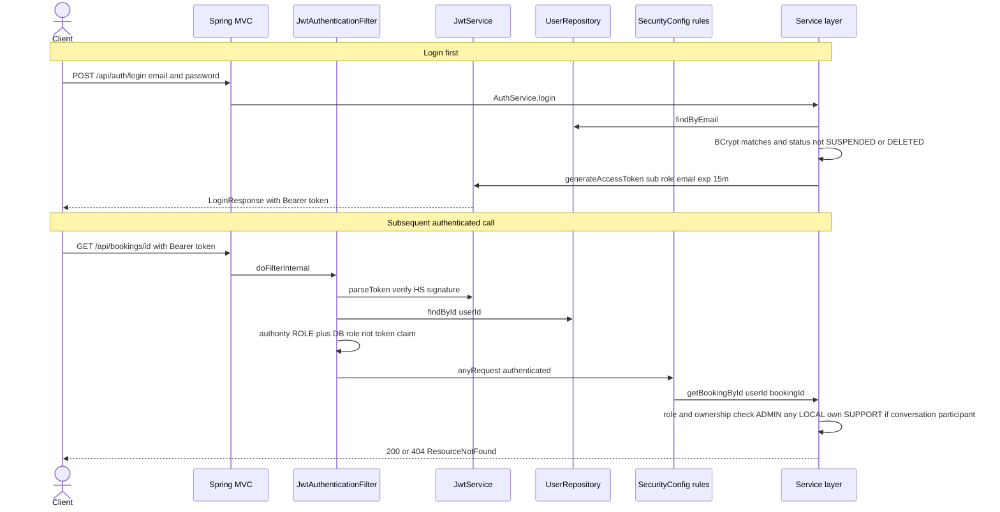
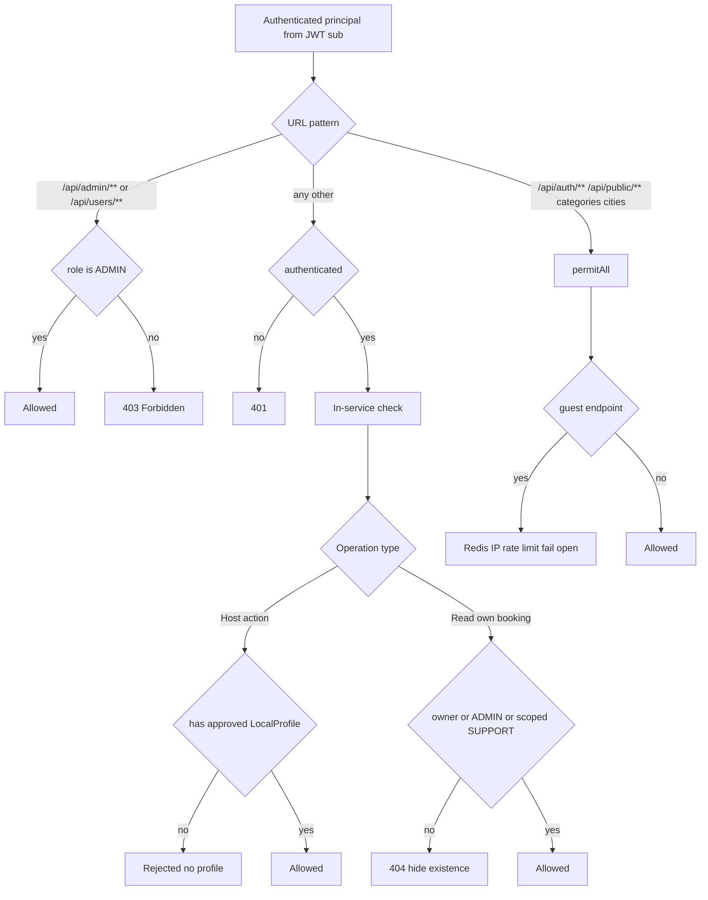
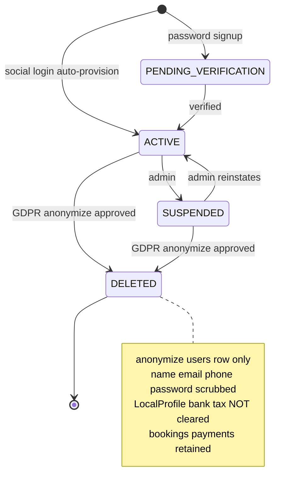
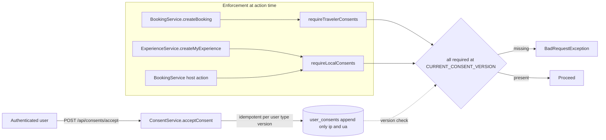

# Security, Identity, Consent & Data Protection

*LocalBuddy backend architecture · June 2026*

## Security, identity, access control, consent & data protection

> Stateless JWT auth with social-token login, a four-role model enforced by a thin URL ruleset plus in-service ownership checks, Redis IP rate limiting on guest endpoints, versioned consent gating for traveler/host actions, and self-service GDPR export plus admin-driven anonymization — with notable gaps around refresh tokens, method-level authZ, auth-endpoint throttling, and host-data erasure.

### Scope and module map

This lens covers authentication, authorization, secrets handling, abuse protection, consent capture/enforcement, GDPR data-subject rights, and audit. The relevant code lives under `src/main/java/com/localbuddy/`:

| Concern | Package / key classes |
| --- | --- |
| Web security wiring | `auth/SecurityConfig` |
| JWT issuance & parsing | `auth/JwtService`, `auth/JwtAuthenticationFilter` |
| Password & social auth | `auth/AuthService`, `auth/SocialAuthService`, `auth/GoogleTokenVerifier`, `auth/FacebookTokenVerifier`, `auth/SocialTokenVerifier`, `auth/StrongPasswordValidator` |
| Role model | `user/UserRole`, `user/UserStatus`, `user/User` |
| Rate limiting | `ratelimit/RateLimitService`, `ratelimit/ClientIpResolver`, `ratelimit/RateLimitProperties` |
| Consent | `consent/ConsentService`, `consent/ConsentType`, `consent/UserConsent`, `consent/ConsentController` |
| GDPR | `gdpr/GdprService`, `gdpr/AccountGdprController`, `gdpr/AdminGdprController`, `gdpr/DataDeletionRequest`, `gdpr/DataDeletionStatus` |
| Audit | `pricing/RateChangeAudit` (rate changes only); `audit/` package is **empty** (only `.gitkeep`) |
| Webhook trust | `payment/StripeWebhookController` |
| Dev bootstrap | `config/DevAdminBootstrap` |

> Note: the `audit/` package exists but contains no code. The only persisted audit trail in the codebase is `pricing/RateChangeAudit` (table `rate_change_audit`, capturing commission/service-fee/VAT rate edits with `changed_by_user_id` and JSONB old/new values). There is **no** general security/access audit log (no record of logins, role changes, GDPR processing actor, or admin actions beyond rate edits).

### Authentication (authN)

**Token-based, stateless.** `SecurityConfig` disables CSRF, form login, and HTTP Basic, sets `SessionCreationPolicy.STATELESS`, and inserts `JwtAuthenticationFilter` before `UsernamePasswordAuthenticationFilter`.

**JWT design (`JwtService`).**
- Algorithm: HMAC-SHA via `Keys.hmacShaKeyFor(jwtSecret.getBytes(UTF_8))` (jjwt 0.12.6). The signing strength depends on the length of `JWT_SECRET`; a short secret silently weakens to a smaller HS key.
- Claims: `subject` = user UUID, plus custom `email` and `role` claims, `iat`, `exp`.
- Expiry: `app.security.jwt.access-token-expiration-minutes`, default **15 minutes**.
- **No refresh token, no issuer/audience claims, no `jti`/revocation list.** Access tokens are the only credential; there is no logout or server-side invalidation path.

**Filter behavior (`JwtAuthenticationFilter`).** Reads the `Authorization: Bearer` header, extracts the user id, then **re-loads the `User` from the database on every request** (`userRepository.findById`). This is a deliberate trade-off: it costs a DB hit per call but means a suspended/deleted user loses access immediately (their role/status is always fresh) rather than waiting for token expiry. Crucially, the granted authority is derived from the **DB role**, not the token's `role` claim — so a tampered role claim is irrelevant, and a privilege change takes effect on the next request. On any `JwtException`/`IllegalArgumentException` the context is cleared and the request proceeds anonymously (to be rejected later by the authorize rules).

One subtlety: the filter does **not** check `UserStatus` — a `SUSPENDED` or `DELETED` user still authenticates if they hold a valid unexpired token. Status is only enforced at login time (`AuthService.login`, `SocialAuthService.socialLogin` reject `SUSPENDED`/`DELETED`), so suspension does not revoke an already-issued token until it expires.

**Password auth (`AuthService`).** Emails are normalized (`trim().toLowerCase()`). Passwords are BCrypt-hashed (`BCryptPasswordEncoder`). `StrongPasswordValidator` enforces 8–100 chars, at least one upper/lower/digit/special, and no whitespace. Login uses a generic "Invalid email or password" message for both unknown-email and bad-password cases (no user enumeration via login). Public signup forbids requesting `ADMIN`/`SUPPORT` roles.

**Social login (`SocialAuthService` + verifiers).** Pluggable via `SocialTokenVerifier` beans keyed by `SocialProvider` (`GOOGLE`, `FACEBOOK`). 
- `GoogleTokenVerifier` calls Google's `tokeninfo` endpoint, optionally checks `aud` against `app.social.google.client-id` **only if that id is configured** (so with no client id set, audience is unverified), and requires `email_verified == true`.
- `FacebookTokenVerifier` calls the Graph `/me` endpoint and requires a non-blank email; it performs **no app-id/audience check at all**.
- A verified social user is matched by email; if none exists, a `LOGGED_IN_USER` is auto-provisioned with `status=ACTIVE`, `emailVerified=true`, and **no password hash**. Account linking is purely email-based, which means a social login can attach to a pre-existing password account that shares the email.

### Authorization (authZ)

Authorization is two-layered and intentionally thin at the URL level.

**Layer 1 — URL rules (`SecurityConfig.authorizeHttpRequests`).**

| Matcher | Rule |
| --- | --- |
| `/api/health`, `/actuator/health`, `/actuator/info`, swagger/`/v3/api-docs/**` | permitAll |
| `/api/auth/**`, `/api/public/**`, `/api/experience-categories/**`, `/api/cities/**` | permitAll |
| `/api/users/**` | `hasRole("ADMIN")` |
| `/api/admin/**` | `hasRole("ADMIN")` |
| anything else | `authenticated()` |

Only **ADMIN** is enforced by route. There is no URL rule for `LOCAL` (host) or `SUPPORT`; every other authenticated endpoint is reachable by any logged-in user at the URL layer.

**Layer 2 — in-service checks.** Finer authorization is done manually inside services:
- **Host (LOCAL) operations** are gated by requiring an (approved) `LocalProfile` for the caller, e.g. `ExperienceService.createMyExperience` → `getApprovedLocalProfileByUserId(userId)`. This is *resource-ownership* authorization: a non-host simply has no profile and is rejected, so the role check is implicit.
- **Booking reads** (`BookingService.getBookingById`) branch explicitly on `UserRole`: `ADMIN` sees any booking; `LOGGED_IN_USER` only their own; `LOCAL` only bookings tied to their profile; and **`SUPPORT` only bookings for a conversation they participate in** (`conversationRepository.existsBookingConversationParticipant`). The inline comment documents this as an IDOR/GDPR mitigation.

> **Discrepancy with internal notes.** `docs/OPEN_FINDINGS.md` and the auto-memory list the "SUPPORT can read ANY booking" IDOR as still open `[verified 06-26]`. The current `getBookingById` source already scopes SUPPORT to conversation participants — so for this code path the finding appears **fixed**; the docs are stale and should be reconciled.

**Key authZ gap: no method security.** There is no `@EnableMethodSecurity` and zero `@PreAuthorize`/`@Secured`/`hasRole` usage outside `SecurityConfig`. Authorization correctness therefore depends entirely on (a) every sensitive endpoint living under `/api/admin/**` or `/api/users/**`, and (b) each service remembering to perform its own ownership check. A new controller placed outside those prefixes that forgets its in-service check is an unguarded-privilege-escalation risk by construction.

### Guest (no-account) identity model

Guests transact without an account. Identity is the tuple **booking reference + guest email**:
- `BookingReferenceGenerator` produces `yyyyMMdd` + a 4-digit daily sequence (row-locked `booking_reference_sequence`), i.e. predictable and enumerable references like `202606270042`.
- `BookingService.lookupGuestBooking` requires the reference **and** a matching `guestEmail` (case-insensitive), and rejects anything whose `bookingSource != GUEST_USER`. Because the reference alone is guessable, the email match is the real authenticator — anyone who knows a guest's email and can guess the daily sequence could attempt lookups, throttled only by IP rate limiting.
- All public guest endpoints (`/api/public/guest-bookings`, `/api/public/payments/...`, guest check-in, no-show, contact, newsletter) gate on `RateLimitService.checkPublicApiLimit(...)` keyed by resolved client IP.

### Secrets and key handling

- All sensitive values are externalized to env vars in `application.yaml` with **no committed defaults** for the truly secret ones: `JWT_SECRET`, `DB_URL/USERNAME/PASSWORD`, `STRIPE_SECRET_KEY`, `STRIPE_WEBHOOK_SECRET`, `REDIS_PASSWORD`, Azure connection strings, wallet certs/keys, `ANTHROPIC_API_KEY`.
- The dev admin (`config/DevAdminBootstrap`) is `@Profile("dev")` only and seeds `app.dev-admin.*` (defaulting to `admin@test.com` / `Password@123`). These defaults are dev-only, but the default values are present in `application.yaml`, so a misconfigured production profile (`SPRING_PROFILES_ACTIVE=dev`) would seed a known-credential admin — operationally important.
- CI (`.github/workflows/azure-webapp.yml`) uses only `secrets.AZURE_WEBAPP_PUBLISH_PROFILE`; runtime secrets are expected to be set as Azure App Service settings, not in the repo.
- Actuator is locked down: only `health,info` exposed and `management.endpoint.health.show-details: never`.

### CORS

`SecurityConfig.corsConfigurationSource` reads `app.cors.allowed-origins` (default `http://localhost:3000`), splits on commas, allows methods `GET,POST,PUT,PATCH,DELETE,OPTIONS`, **all headers**, and `allowCredentials=true`. Because credentials are allowed, the origin list must be a concrete allow-list (it is — no wildcard), but it **defaults to localhost** and must be set to real production origins before launch. No `exposedHeaders` are configured.

### Rate limiting

`RateLimitService.checkPublicApiLimit(key)` implements a fixed-window counter in Redis (`rate-limit:public:<key>`, `INCR` + `EXPIRE` on first hit), governed by `app.rate-limit.public-api.{enabled,maxRequests,windowSeconds}` (defaults: enabled, **20 requests / 60 s**). Notable properties:

- **Client identity is spoofable.** `ClientIpResolver` trusts the first `X-Forwarded-For` value, then `X-Real-IP`, then `getRemoteAddr()` — no trusted-proxy validation, so an attacker can rotate the header to evade limits.
- **Fails open.** Any non-`BadRequestException` runtime error (e.g. Redis down) is swallowed and the request proceeds unthrottled. Spring's Redis health check is also disabled (`management.health.redis.enabled: false`), so an outage is silent.
- **Wrong status code.** A breach throws `BadRequestException` → **HTTP 400**, not 429.
- **Coverage gaps.** Only specific guest controllers call it. The **auth endpoints (`/api/auth/login`, `/signup`, `/social`) are not rate limited at all**, leaving password brute-force / credential-stuffing unthrottled. Public read/enumeration endpoints (experiences, promo validate, gift-card balance) are also not throttled.

### Versioned consent enforcement

`ConsentService` holds a single source-of-truth version constant `CURRENT_CONSENT_VERSION = "2026-05-v1"` and two required sets:

| Set | Required `ConsentType`s |
| --- | --- |
| `REQUIRED_TRAVELER_CONSENTS` | `TERMS_OF_SERVICE`, `PRIVACY_POLICY` |
| `REQUIRED_LOCAL_CONSENTS` | `TERMS_OF_SERVICE`, `PRIVACY_POLICY`, `COMMUNITY_GUIDELINES` |

`ConsentType` also defines `SAFETY_GUIDELINES` and `LIABILITY_ACKNOWLEDGEMENT`, which are not currently in any required set.

- **Capture.** `acceptConsent` is idempotent per `(user, type, version)` (DB unique constraint `uk_user_consents_user_type_version`) and records `acceptedAt`, `ipAddress`, and `userAgent` for evidentiary purposes. Rows are append-only/immutable in practice (versions create new rows; the entity's `@PreUpdate` only touches `updatedAt`).
- **Enforcement.** Gating is checked at the action, not at login: `BookingService` calls `requireTravelerConsents(loggedInUserId)` before a logged-in booking and `requireLocalConsents` before host booking actions; `ExperienceService.createMyExperience` calls `requireLocalConsents`. A missing current-version consent throws `BadRequestException`. Status is computed by filtering the user's consents to those whose `version` equals `CURRENT_CONSENT_VERSION`, so bumping the constant automatically forces re-acceptance.
- **Gaps.** Enforcement is only wired into booking/experience-create paths found in code; other authenticated flows do not re-check consent. Guest (no-account) bookings have no consent capture in this model. There is no consent withdrawal/revocation endpoint.

### GDPR — export and erasure

Self-service controller `AccountGdprController` (`/api/account/gdpr`) and admin controller `AdminGdprController` (`/api/admin/gdpr`).

- **Export (`GdprService.exportMyData`).** Synchronous, read-only aggregation of the subject's account, consents, notification preferences, bookings, payments, reviews, and geo check-ins into `GdprExportResponse`. Returns directly over HTTP (no async job, no signed download, no size guard).
- **Erasure workflow.** `requestDeletion` creates a `DataDeletionRequest` (`status=REQUESTED`, one pending request enforced via `existsByUserIdAndStatus`). An admin then calls `process` (anonymize) or `reject`. `processDeletionRequest` is guarded only by the `/api/admin/**` ROLE_ADMIN URL rule.
- **Anonymization (`GdprService.anonymize`).** In-place mutation of the `users` row: `fullName="Deleted User"`, `email="deleted+<id>@deleted.localbuddy.invalid"`, `phone=null`, `passwordHash=null`, `emailVerified/phoneVerified=false`, `status=DELETED`. Bookings, payments, reviews, and check-ins are intentionally retained (referential integrity / financial records) but **de-linked only by virtue of the user row being scrubbed**.
- **Known erasure gaps (real in code):**
  - **Host data is not erased.** `anonymize` touches only `users`; it does not clear `LocalProfile` PII or any bank/tax/payout fields. A host's personal and financial data survives a deletion request (matches the Red finding in `docs/OPEN_FINDINGS.md`).
  - **No actor recorded.** The processed request stores `processedAt` and an optional `adminNote`, but **not which admin processed it** — there is no audit of who performed the erasure.
  - **PII spread.** `guest_email`/booking PII and consent `ip_address`/`user_agent` rows are not addressed by anonymization; check-in rows have their own 90-day retention job (`app.checkin.retention-days`) but other tables do not.

### Webhook trust boundary

`StripeWebhookController` (`/api/public/payments/webhooks/stripe`, public per the `/api/public/**` rule) **requires** a configured `STRIPE_WEBHOOK_SECRET` (throws `IllegalStateException` if absent) and verifies the `Stripe-Signature` header via `Webhook.constructEvent` before processing — i.e. the public route is protected by signature verification rather than auth. Invalid signatures are logged at WARN and rejected.

### Public profile / sensitive-field exposure

The brief flags "public profile exposing sensitive fields." The `User` entity carries `email`, `phone`, and `passwordHash`. `passwordHash` is never serialized in any response DTO. `CurrentUserResponse` (the `/api/auth/me` payload) does expose `email` and `phone`, but only to the authenticated owner. I did not find a dedicated public user/host profile endpoint that serializes the raw `User` (host data is surfaced via `LocalProfile`); a full audit of every host-facing DTO for over-exposure (e.g. host email/phone on public experience pages) was out of scope here and should be verified field-by-field.

### Architectural decisions and trade-offs

| Decision | Trade-off |
| --- | --- |
| Stateless JWT, 15-min expiry, **no refresh token / no revocation** | Simple and horizontally scalable; but no logout, suspension doesn't revoke live tokens, and short expiry forces frequent re-login (no refresh UX). |
| Per-request DB user load in the filter | Always-fresh role/status and instant lockout on next call; costs one DB read per authenticated request. |
| Authority derived from DB role, not token claim | Token tampering of `role` is moot; but the token still *carries* `role`/`email` (info leak if logged). |
| Thin URL rules + manual in-service checks; **no method security** | Flexible ownership logic; but correctness hinges on convention, and any endpoint outside `/api/admin` or `/api/users` that omits its check is unguarded. Enabling `@EnableMethodSecurity` would harden this. |
| Resource-ownership authZ for hosts (require `LocalProfile`) | Avoids hardcoding role-route maps; but the `LOCAL` role itself is unenforced at the URL layer. |
| Guest identity = enumerable reference + email | Frictionless guest UX; security rests on the email match and IP rate limiting, both weak against a targeted attacker. |
| Rate limiting fails open + spoofable IP + 400 not 429 | Availability over strictness; but Redis outage = no throttling, and `X-Forwarded-For` trust enables evasion. |
| Auth endpoints unthrottled | No brute-force / credential-stuffing protection on login/social. |
| Versioned consent via single constant | Trivial to force global re-consent; but enforcement only wired into booking/experience paths, and no withdrawal flow. |
| In-place anonymization of `users` only | Preserves financial/referential integrity; but leaves host `LocalProfile` + bank/tax data and consent IP/UA, and records no processing actor. |
| Social audience check optional/absent | Works before client IDs are provisioned; but Google audience is unverified when unset and Facebook app-id is never verified — tokens minted for another app could be accepted. |

### Diagrams

#### Authentication & request authorization flow

#### Authorization model — roles, routes and resource ownership

#### User account & GDPR deletion lifecycle

#### Consent capture and enforcement

### Key architectural decisions & trade-offs

- Stateless, non-revocable access tokens only: HS256 JWT, 15-minute default expiry (app.security.jwt.access-token-expiration-minutes), no refresh token and no server-side session or token blacklist. Logout and revocation are impossible until natural expiry.
- Authorization is split across two layers: coarse URL rules in SecurityConfig (only /api/users/** and /api/admin/** are pinned to ROLE_ADMIN; everything else is merely authenticated), and fine-grained ownership/role checks performed manually inside services (e.g. BookingService.getBookingById, LocalProfile lookups). Method-level security (@EnableMethodSecurity / @PreAuthorize) is NOT enabled anywhere.
- LOCAL (host) authorization is resource-driven, not route-driven: host operations require an approved LocalProfile for the caller rather than a role check on the URL, so the JWT role claim is largely advisory outside the ADMIN routes.
- Guest (no-account) identity = booking reference plus matching guest email, verified on every lookup (BookingService.lookupGuestBooking); guest mutations are protected only by Redis IP rate limiting, not by a secret token.
- Versioned consent enforcement: a single CURRENT_CONSENT_VERSION constant (2026-05-v1) gates traveler bookings (requireTravelerConsents) and host actions (requireLocalConsents); consents are immutable, append-only rows capturing IP and User-Agent for evidentiary value.
- GDPR erasure is a request-then-admin-approve workflow that anonymizes the users row in place (overwrites name/email/phone, nulls password) rather than hard-deleting, preserving booking/payment referential integrity; export is self-service and synchronous.
- Secrets (JWT secret, DB, Stripe, social client IDs, Azure, wallet keys) are externalized entirely to environment variables in application.yaml with no committed defaults for the sensitive ones; the seeded dev admin is confined to the dev Spring profile.
- Rate limiting fails open: any Redis/infrastructure error in RateLimitService is swallowed so the app keeps serving (no throttle), and limit breaches return HTTP 400 rather than 429.

---

[← back to the architecture index](./README.md)
