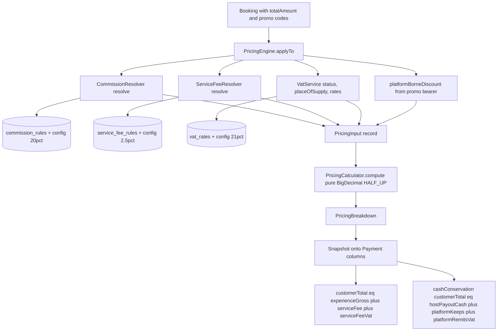
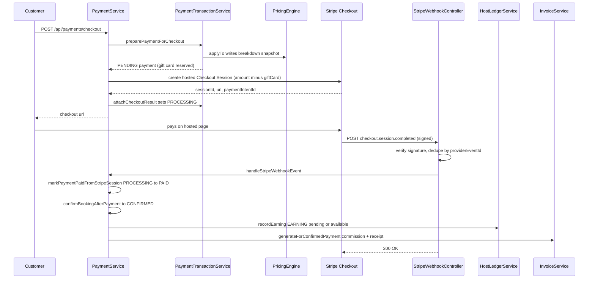
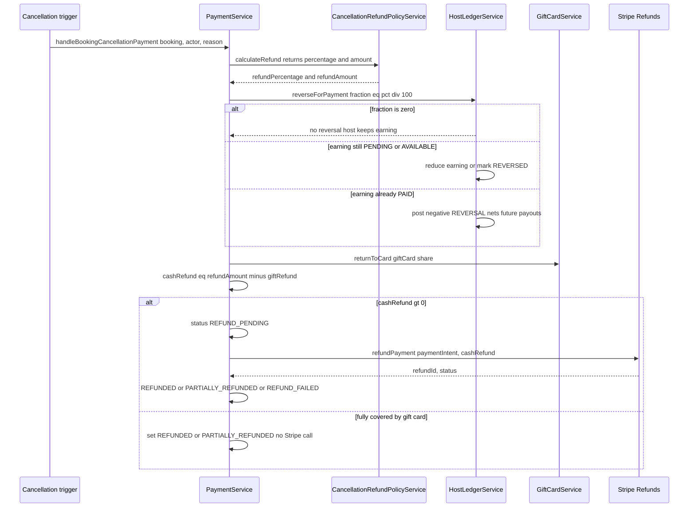
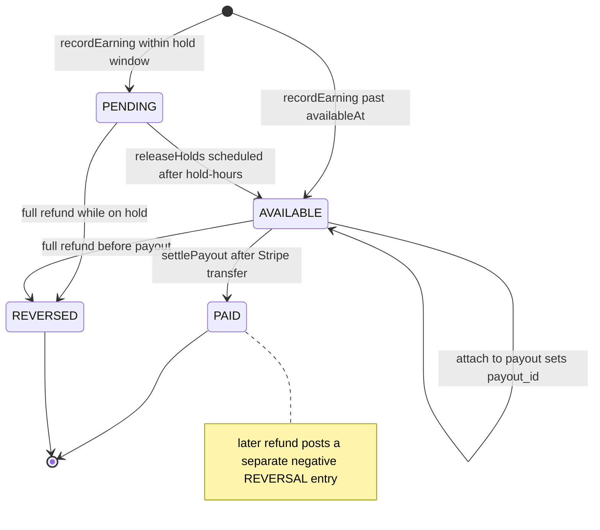
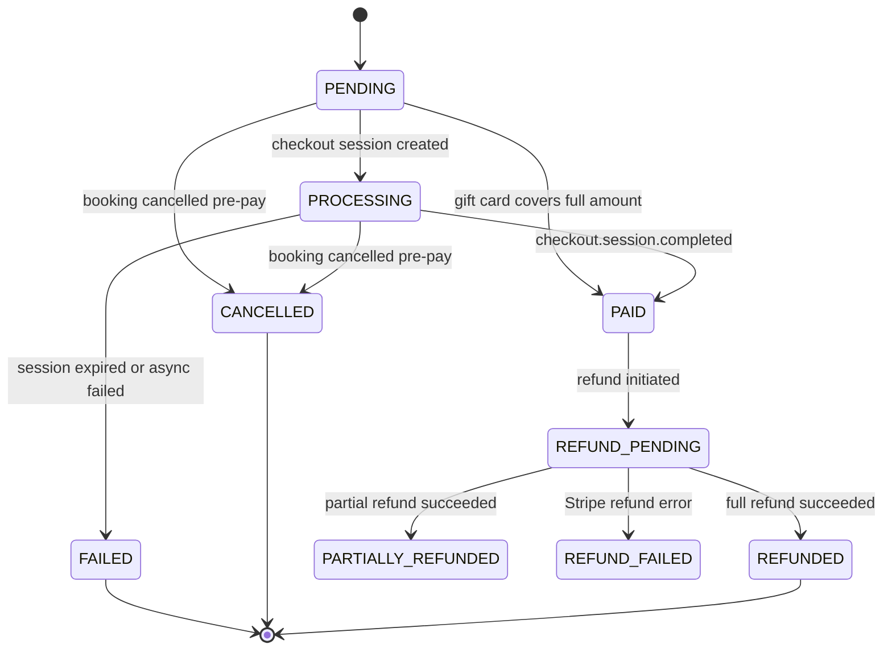
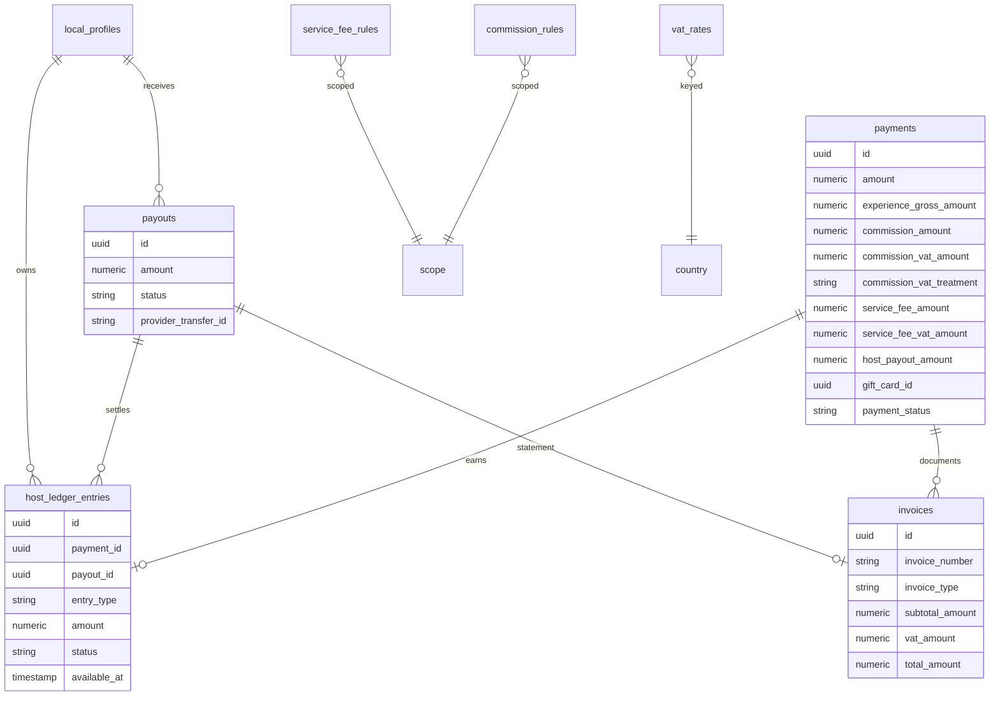

# Money — Pricing Engine, Payments, Payouts & Invoicing

*LocalBuddy backend architecture · June 2026*

## Money: pricing engine, payments, payouts, invoicing

> A deterministic BigDecimal pricing engine snapshots a full per-transaction financial breakdown onto each Payment; Stripe hosted checkout + idempotent webhooks confirm bookings; a host earnings ledger with hold windows and proportional clawback drives scheduled Stripe Connect payouts; and an immutable invoice/receipt/statement set closes the VAT loop.

## Money: Pricing Engine, Payments, Payouts, Invoicing

This lens covers the end-to-end financial model: how a customer-facing price is decomposed into experience value, platform commission, customer service fee, and per-leg VAT; how Stripe hosted checkout charges the customer and confirms the booking; how host earnings accrue on a ledger and are disbursed via Stripe Connect; and how immutable VAT invoices, receipts, and payout statements are issued. All four concerns live in dedicated packages under `com.localbuddy`: `pricing/`, `payment/`, `payout/`, `invoice/`.

### Design Principles (verified in code)

- **Pure calculator + impure resolver split.** `PricingCalculator` (`@Component`) is a dependency-free function from `PricingInput` to `PricingBreakdown`. `PricingEngine` (`@Service`) resolves the inputs (rates, VAT, discounts) from the DB/config and is the only thing that touches the domain. This makes the arithmetic unit-testable in isolation against golden vectors (`PricingCalculatorTest`, 10 adversarial scenarios, all asserting the cash-conservation invariant).
- **BigDecimal everywhere, HALF_UP, 2 decimals.** Money columns are `NUMERIC(10,2)` (payments) / `NUMERIC(12,2)` (ledger/payouts); rates are `NUMERIC(5,4)` decimals (`0.2100` = 21%). `PricingCalculator.round()` applies `setScale(2, HALF_UP)` to every line before summing. No `double`/`float` appears in the money path.
- **Immutable per-transaction snapshot.** The full breakdown is written onto the `payments` row (`commission_*`, `service_fee_*`, `experience_*`, `host_payout_amount`, `place_of_supply_country`) at payment-prepare time via `PricingEngine.applyTo`. Downstream invoices, ledger entries, and payouts read these snapshot columns, so changing a rate rule later never retro-alters an issued document.

---

### 1. Pricing Engine

#### Classes & responsibilities

| Class | Type | Responsibility |
|---|---|---|
| `PricingEngine` | `@Service` | Resolves all rates/VAT/discounts for a `Booking`, calls the calculator, writes the breakdown onto a `Payment` (`applyTo`) or returns a preview (`priceBooking`). |
| `PricingCalculator` | `@Component` | Pure arithmetic: gross/net/VAT, commission + commission VAT treatment, service fee + VAT, settlement (host payout, platform keep, VAT remitted). |
| `PricingInput` / `PricingBreakdown` | `record` | Immutable in/out value objects. |
| `CommissionResolver` | `@Service` | Resolves commission rate by scope precedence + config default `app.platform.commission-percentage` (20%). |
| `ServiceFeeResolver` | `@Service` | Resolves service-fee rate, same precedence; config default `app.fees.service-fee-percentage` (2.5%). |
| `VatService` | `@Service` | Resolves host VAT status, place of supply, experience VAT rate, and fee VAT rate. |
| `RateAdminService` | `@Service` | Admin CRUD over commission/service-fee/VAT rules with `rate_change_audit` trail and the max-commission cap. |

#### Rate resolution precedence

Both `CommissionResolver` and `ServiceFeeResolver` walk scopes most-specific-first, first match wins. Commission additionally honors per-row override columns:

```
experience.commissionRate column
  -> active EXPERIENCE-scoped rule
  -> host.commissionRate column
  -> active HOST rule
  -> CATEGORY rule -> CITY rule -> PLATFORM rule
  -> config default (app.platform.commission-percentage / 100)
```

`ScopeType` enum encodes the order: `PLATFORM < CITY < CATEGORY < HOST < EXPERIENCE`. Rules are time-boxed (`effective_from`/`effective_to`) and `active`, so time-limited promos are just rules at the right scope (`CommissionRuleRepository.findActive(scope, scopeId, now)`).

#### VAT model

`VatService.hostVatStatus()` maps `(taxCountry, vatRegistered)` to `HostVatStatus`:

| Host situation | `HostVatStatus` | Experience-leg VAT | Commission-leg treatment |
|---|---|---|---|
| Registered, home country (NL) | `NL_REGISTERED` | charged at experience rate | `STANDARD` (VAT charged, host reclaims) |
| Not registered (KOR/private), in EU | `NL_NOT_REGISTERED` | **none** | `NOT_REGISTERED` (VAT charged, host cannot reclaim) |
| Registered, other EU country | `EU_OTHER_REGISTERED` | charged at experience rate | `REVERSE_CHARGE` (no VAT, host self-accounts) |
| Outside EU | `NON_EU` | **none** | `OUT_OF_SCOPE` |

`EU_COUNTRIES` is a hard-coded 27-member set. **Place of supply is currently always the platform home country** (`placeOfSupply()` returns `homeCountry` — a documented simplification; per-city ISO mapping is a noted TODO). Experience VAT rate = place-of-supply × category × date (`vat_rates`), falling back to the country `STANDARD` row, then `app.vat.standard-rate-percentage` (21%). Fee VAT always uses the home-country standard rate.

#### The settlement arithmetic (`PricingCalculator.compute`)

```
effectiveExpVat = hostCarriesVat ? experienceVatRate : 0      // only NL_REGISTERED / EU_OTHER_REGISTERED carry it
experienceGross = enteredPrice (GROSS mode)                   // or net*(1+vat) in NET mode
experienceNet   = gross / (1 + effectiveExpVat)
experienceVat   = gross - net

hostGross       = hostExperienceGross ?? experienceGross      // higher when platform absorbs a discount
commission      = hostGross * commissionRate
commissionVat   = (NL_*) ? commission * feeVatRate : 0
serviceFee      = experienceGross * serviceFeeRate
serviceFeeVat   = serviceFee * feeVatRate

customerTotal   = experienceGross + serviceFee + serviceFeeVat
hostPayoutCash  = hostGross - commission - commissionVat
platformKeeps   = commission + serviceFee - platformBorneDiscount
platformRemitsVat = commissionVat + serviceFeeVat
```

**Customer invariant:** `customerTotal = experienceGross + serviceFee + serviceFeeVat`. The service fee is charged *on top of* the post-discount experience gross (confirmed in `PricingEngine` Javadoc and `compute` Step 4).

**Cash-conservation invariant:** `customerTotal == hostPayoutCash + platformKeeps + platformRemitsVat`. This holds exactly when the host bears the discount. When the platform absorbs a discount (`hostGross > experienceGross`), `hostPayoutCash` is computed on `hostGross` while `customerTotal` is computed on `experienceGross` and `platformKeeps` subtracts `platformBorneDiscount` to compensate — `PricingCalculatorTest` asserts the identity within a **0.02 rounding tolerance** rather than exactly. Architects should treat the invariant as "holds within rounding," not bit-exact.

#### Discount-bearer handling

`PricingEngine.platformBorneDiscount()` sums, across all `BookingPromoCode`s (multi-code stacking) or the legacy single `promoCode`, the platform's share of each discount via `PromoCode.discountBearer`: `HOST` → 0, `PLATFORM` → full discount, `SPLIT` → `discount × platformSharePercentage / 100`. That sum is added to `experienceGross` to form `hostExperienceGross`, so the host earns on the un-absorbed portion.

#### Guardrail

`RateAdminService.createCommissionRule` rejects any commission rate above `app.platform.max-commission-rate` (default `0.50`) — explicitly to prevent commission + commission VAT from driving `hostPayoutCash` negative. Rates must be fractions in `[0,1]`; DB `CHECK` constraints (`chk_commission_rate`, `chk_service_fee_rate`, `chk_vat_rate`) enforce the same at the storage layer.

---

### 2. Payments (Stripe hosted checkout)

#### Integration model

Stripe is integrated via the official SDK `StripeClient` (`StripeClientConfig` bean, built from `app.payments.stripe.secret-key`). `StripePaymentCheckoutProvider` (implements `PaymentCheckoutProvider`) creates **hosted Checkout Sessions** in `PAYMENT` mode — no card data ever touches the backend (PCI scope minimized). Config record `StripeProperties` binds `secret-key`, `webhook-secret`, `success-url`, `cancel-url`.

#### Checkout creation flow

`PaymentService.createCheckout` is deliberately **not** `@Transactional` (it must not hold a DB transaction across the Stripe network call). It delegates to:
1. `PaymentTransactionService.preparePaymentForCheckout` (`@Transactional`) — finds/creates a PENDING `Payment`, runs `PricingEngine.applyTo`, optionally reserves a gift card (`GiftCardService.reserveForCheckout`) atomically with the payment, and pre-initializes lazy fields.
2. If a gift card covers the whole amount (or all but a sub-Stripe-minimum remainder), `completeWithoutStripeCharge` marks it PAID and finalizes — bypassing Stripe entirely (`shouldCompleteWithoutStripeCharge` against `app.payments.stripe.minimum-charge`, default €0.50; the platform absorbs the sub-minimum remainder).
3. Otherwise `StripePaymentCheckoutProvider.createCheckout` charges `amount − giftCardAmount` (in cents via `movePointRight(2).longValueExact()`), with `paymentId`/`bookingId` in session metadata and `client_reference_id`.
4. `PaymentTransactionService.attachCheckoutResult` (`@Transactional`) flips the payment to PROCESSING and stores the session id / payment-intent id / checkout URL.

A Spring self-injection (`@Lazy PaymentService self`) routes `completeWithoutStripeCharge` / `releaseGiftCardOnFailure` back through the proxy so their `@Transactional` boundaries actually apply (self-invocation would otherwise bypass them). On any `RuntimeException` the reserved gift card is released.

#### Status lifecycle (`PaymentStatus`)

`PENDING → PROCESSING → PAID`; terminal/branch states `FAILED`, `CANCELLED`, `REFUNDED`, `PARTIALLY_REFUNDED`, `REFUND_PENDING`, `REFUND_FAILED`. An active payment is blocked if one already exists in `{PENDING, PROCESSING, PAID}` (`existsByBookingIdAndPaymentStatusIn`).

#### Webhook handling

`StripeWebhookController` (`POST /api/public/payments/webhooks/stripe`) **requires** a configured webhook secret and verifies the `Stripe-Signature` via `Webhook.constructEvent` (rejects on `SignatureVerificationException`). It calls `PaymentService.handleStripeWebhookEvent(Event, rawPayload)`, which:
- **Idempotency:** short-circuits if `(STRIPE, providerEventId)` already exists in `payment_webhook_events`; otherwise persists the raw event with `processed`/`processingError`.
- **`checkout.session.completed`:** if session metadata carries a `giftCardId`, activates the purchased gift card; otherwise `markPaymentPaidFromStripeSession` flips PENDING/PROCESSING → PAID, records the payment-intent id, then finalizes.
- **`checkout.session.expired` / `async_payment_failed`:** `handleFailedOrExpiredCheckoutSession` marks FAILED, releases any gift card, and immediately frees the seat (`BookingExpiryService.releaseBookingSlotAfterFailedPayment`).

`markPaymentPaidFromStripeSession` is **status-guarded** (idempotent against already-PAID; rejects from REFUNDED/CANCELLED) and includes a **late-payment safety net**: if the booking's hold expired and the slot was released before the payment landed, it issues a full refund instead of confirming (`refundFullPayment`).

> **Note (potential gap):** Only the three checkout events are handled. There is no `charge.refunded` / `payment_intent.*` reconciliation, and refund status is set synchronously from the Stripe `Refund.status` response (`succeeded` → REFUNDED/PARTIALLY_REFUNDED, else REFUND_PENDING). Asynchronously-settling refunds are not later reconciled by webhook. A second, older entry point `handleStripeWebhook(StripeWebhookRequest)` (unsigned DTO) also exists but the signed `Event` path is the one wired to the controller.

#### Post-payment finalization

`finalizePaidBooking` (shared) redeems promo + referral codes, confirms the booking (`PENDING_PAYMENT`/`ACCEPTED` → `CONFIRMED` + sends confirmation), records the host earning on the ledger, records gift-card redemption, and generates invoices — making payment confirmation the single fan-out point into ledger and invoicing.

---

### 3. Payouts (Stripe Connect + host ledger)

#### Ledger model (`host_ledger_entries`, V10) — the source of truth

`HostLedgerService` manages an append-style ledger keyed by `localProfileId`. `LedgerEntryType` = `EARNING | REVERSAL | ADJUSTMENT`; `LedgerEntryStatus` = `PENDING | AVAILABLE | PAID | REVERSED`.

- **`recordEarning`** posts an EARNING for `payment.hostPayoutAmount`, status `PENDING` if within the hold window else `AVAILABLE`. `availableAt = experience end + app.payout.hold-hours` (default 72h). Idempotency is double-guarded: an app-level `existsByPaymentIdAndEntryType` check **and** a partial unique index `ux_ledger_earning_per_payment` (one EARNING per payment), with `DataIntegrityViolationException` swallowed on concurrent confirm.
- **`releaseHolds`** (`@Scheduled fixedDelay app.payout.ledger-release-delay-ms`, 5 min) flips due PENDING → AVAILABLE in batches of 500.
- **Balances** (`HostLedgerBalances`): onHold (PENDING sum), availableNow (AVAILABLE, unattached), paidOut (PAID sum), lifetime net.

#### Connect onboarding

`StripeConnectPayoutProvider` creates **Express** accounts (`AccountCreateParams.Type.EXPRESS`) and hosted onboarding links (`AccountLinkCreateParams`, refresh/return URLs from `app.payouts.connect.*` — note these default in code and are **not** present in `application.yaml`). `HostPayoutService.createConnectOnboarding` stores `localProfiles.stripe_connect_account_id`. The host must also have `payouts_enabled = true` for auto-disbursement.

#### Payout run

`PayoutScheduler` (`@Scheduled fixedDelay app.payout.processor-delay-ms`, 1h) acts only on the cadence's payout day (`app.payout.schedule`: WEEKLY/BIWEEKLY/MONTHLY, `day-of-month` clamped to 1–28). For each host with an available balance ≥ `app.payout.minimum-amount` (€25), it calls `HostPayoutService.createPayoutForHost`, which:
1. Sums the host's AVAILABLE, unattached ledger entries into a `Payout` (PENDING) in `payouts`.
2. **Reserves** those entries by stamping `payout_id` (`attachToPayout`) so they cannot be paid twice.
3. If Connect is configured + host onboarded: `transfer()` (separate-charge-and-transfer model), then PAID + `settlePayout` (entries → PAID) + payout statement. On failure → FAILED with entries **still reserved** (never double-paid); an admin can `mark-paid` (offline) or `retry`.

#### Clawback (refund-driven)

`PaymentService.handleBookingCancellationPayment` computes the refund via `CancellationRefundPolicyService` (policy by `cancelledBy` actor × hours-before-start, refund% of `booking.totalAmount`). It then **proportionally reverses** the host earning: `refundFraction = refundPercentage / 100`, passed to `HostLedgerService.reverseForPayment(paymentId, fraction, reason)`:
- 0% refund → no reversal (host keeps full earning).
- Still PENDING/AVAILABLE → reduce the earning in place (or mark REVERSED if full).
- Already PAID → post a negative `REVERSAL` entry that nets against future earnings (true clawback).

The refund itself is **split**: gift-card share returns to the card (`giftCardService.returnToCard`); only the cash share goes to Stripe (`refundPayment`), with `REFUND_PENDING → REFUNDED/PARTIALLY_REFUNDED` or `REFUND_FAILED`.

> **Observation:** The V2 `payout_items` table (with `ux_payout_items_payment` uniqueness) predates the V10 ledger and is **not written** by the current `HostPayoutService` — disbursement is tracked entirely via `payout_id` on ledger entries. `payout_items` appears to be legacy/dead schema.

---

### 4. Invoicing

`InvoiceService` issues three immutable document types (`InvoiceType`):

| Type | Recipient | Trigger | Content |
|---|---|---|---|
| `COMMISSION` | HOST | `generateForConfirmedPayment` | Platform commission + commission VAT, with a `vatNote` per `commission_vat_treatment` (reverse-charge / KOR / out-of-scope). |
| `SERVICE_FEE_RECEIPT` | CUSTOMER | `generateForConfirmedPayment` | Service fee + service-fee VAT. |
| `PAYOUT_STATEMENT` | HOST | `generatePayoutStatement` (on payout settle) | Lines per settled ledger entry; remittance only (VAT detail is on commission invoices). |

- **Immutability:** issuer legal/BTW details are snapshotted from the single active `company_settings` row (`legalName`, `vatNumber`, address, country) onto each `Invoice` at issue time.
- **Numbering:** `InvoiceNumberService.next(prefix, year)` allocates gap-free sequential numbers per year under `SELECT ... FOR UPDATE` (`invoice_sequence`), formatted `PREFIX-YYYY-0001`.
- **Idempotency:** guarded by `existsByBookingIdAndInvoiceType` / `existsByPayoutIdAndInvoiceType`.
- **Access control:** `renderPdf` enforces that a non-admin requester is either the invoice's host or the booking's logged-in user (`InvoicePdfService` renders the PDF). Notifications fire via `NotificationType.INVOICE_ISSUED`.

---

### Configuration keys (money path)

| Key | Default | Effect |
|---|---|---|
| `app.platform.commission-percentage` | 20 | Fallback commission when no PLATFORM rule exists. |
| `app.platform.max-commission-rate` | 0.50 | Hard cap admins can assign. |
| `app.fees.service-fee-percentage` | 2.5 | Fallback service fee. |
| `app.vat.default-country` / `standard-rate-percentage` | NL / 21 | Home country + fallback standard VAT. |
| `app.vat.merchant-of-record` | INTERMEDIARY | MoR posture (INTERMEDIARY \| DEEMED_SUPPLIER) — config only; not yet branching logic in the calculator. |
| `app.payout.schedule` / `hold-hours` / `minimum-amount` / `day-of-month` | MONTHLY / 72 / 25 / 1 | Payout cadence, ledger hold, threshold. |
| `app.payments.stripe.{secret-key,webhook-secret,success-url,cancel-url}` | — | Stripe hosted checkout + webhook. |
| `app.payments.stripe.minimum-charge` | 0.50 | Sub-minimum cash remainder the platform absorbs. |
| `app.payouts.connect.{refresh,return}-url` | localhost defaults (code only) | Connect onboarding redirects (not in `application.yaml`). |

### Trade-offs & risks for an architect

- **Place of supply hard-coded to home country** — incorrect for cross-border experiences; a documented TODO.
- **Refund reconciliation is synchronous-only** — no `charge.refunded` webhook; async refund settlement and disputes/chargebacks are not reconciled back into `PaymentStatus`.
- **Cash-conservation holds only within rounding** under platform-borne discounts (0.02 test tolerance), because `customerTotal` and `hostPayoutCash` use different gross bases.
- **Dead `payout_items` schema** coexists with the live ledger — a cleanup/clarity risk.
- **MoR config (`merchant-of-record`) is inert** — present in config but not yet driving deemed-supplier VAT logic.

### Diagrams

#### Pricing engine flow and components



#### Booking to checkout to webhook to confirm



#### Refund and proportional clawback



#### Host ledger entry lifecycle



#### Payment status lifecycle



#### Money data model



### Key architectural decisions & trade-offs

- Pricing is a pure, dependency-free calculator (PricingCalculator) fed by resolved inputs (PricingEngine + resolvers), verified against golden vectors and a cash-conservation invariant in PricingCalculatorTest — separating rate resolution (DB/config) from arithmetic.
- Every monetary value is BigDecimal NUMERIC(_,2) rounded HALF_UP per line before summing; rates are NUMERIC(5,4) decimals (0.2100 = 21%). No floating point anywhere in the money path.
- The full breakdown is snapshotted onto the Payment row at checkout-prep time (commission/service-fee/VAT/payout columns) so issued invoices and payouts are immutable even if rate rules change later.
- Customer pricing invariant: customerTotal = experienceGross + serviceFee + serviceFeeVat — the service fee is added ON TOP of the (post-discount) experience gross, not carved out of it.
- Commission base is hostGross (which can exceed customerGross when the platform absorbs a promo discount), letting the host still earn on platform-borne discounts while the platform's margin absorbs them.
- Host VAT status (NL_REGISTERED / NL_NOT_REGISTERED / EU_OTHER_REGISTERED / NON_EU) drives both experience-leg VAT and commission-leg VAT treatment (STANDARD / NOT_REGISTERED / REVERSE_CHARGE / OUT_OF_SCOPE).
- Stripe is integrated as hosted Checkout Sessions (no card data touches the backend); the platform is merchant-of-record (INTERMEDIARY) and pays hosts separately via Stripe Connect Express transfers — a separate-charge-and-transfer model, not destination charges.
- Webhook idempotency is enforced by a unique (provider, providerEventId) on payment_webhook_events; signature verification is mandatory in StripeWebhookController.
- Payouts run off a double-entry-ish host ledger (host_ledger_entries) with a hold window (experience end + app.payout.hold-hours, default 72h); earnings are PENDING then AVAILABLE then PAID, with a unique index guaranteeing one EARNING per payment.
- Refund triggers a PROPORTIONAL clawback: the host earning is reversed only by the same fraction the customer is actually refunded (0% refund leaves the host whole), splitting gift-card share back to the card and cash share to Stripe.
- Commission rate is hard-capped by app.platform.max-commission-rate (default 0.50) in RateAdminService to guard against driving host payout negative once commission VAT is added.
- Invoice numbers are gap-free per-year sequences allocated under a SELECT ... FOR UPDATE row lock (InvoiceNumberService), and issuer company/BTW details are snapshotted onto each invoice.


---


[← back to the architecture index](./README.md)
