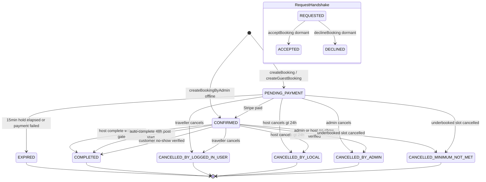
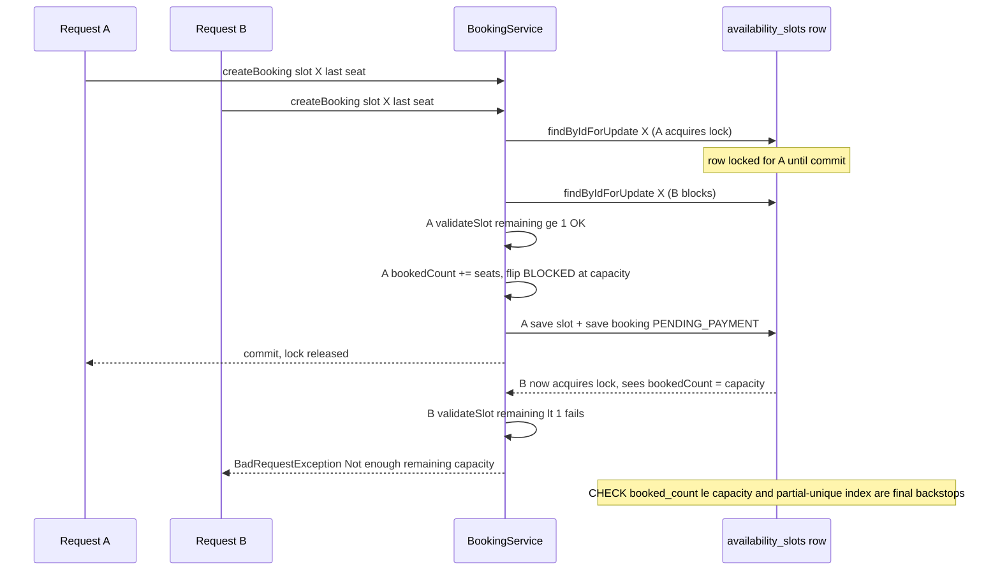
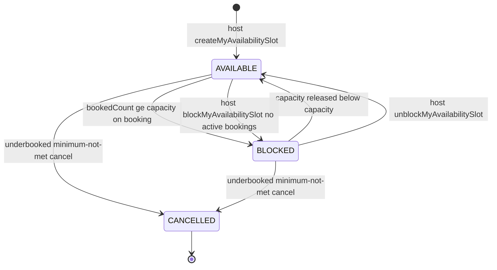

# Booking, Availability, Concurrency & Lifecycle

*LocalBuddy backend architecture · June 2026*

## Booking, availability, concurrency & lifecycle

> Seat reservation is guarded by pessimistic row locks on availability_slots plus DB CHECK/partial-unique backstops, and bookings move through a payment-driven lifecycle (PENDING_PAYMENT to CONFIRMED to COMPLETED) reconciled by four scheduled sweepers.

### Scope & key types

This lens covers the `com.localbuddy.availability` and `com.localbuddy.booking` packages plus the satellite services that drive booking state transitions: `com.localbuddy.noshow`, `com.localbuddy.attendance`, `com.localbuddy.safety`, and the relevant slice of `com.localbuddy.payment.PaymentService`.

| Concern | Real artifact |
|---|---|
| Slot entity | `AvailabilitySlot` (table `availability_slots`): `capacity`, `bookedCount`, `status` |
| Slot status enum | `AvailabilityStatus` = `AVAILABLE`, `BLOCKED`, `CANCELLED` |
| Booking entity | `Booking` (table `bookings`): `seatsBlocked`, `guestsCount` + age bands, `status`, `attendanceOutcome`, `guestShowStatus` |
| Booking status enum | `BookingStatus` = `REQUESTED`, `ACCEPTED`, `PENDING_PAYMENT`, `CONFIRMED`, `DECLINED`, `CANCELLED_BY_LOGGED_IN_USER`, `CANCELLED_BY_LOCAL`, `CANCELLED_BY_ADMIN`, `CANCELLED_MINIMUM_NOT_MET`, `COMPLETED`, `EXPIRED` |
| Booking mode enum | `BookingMode` (on `Experience`) = `SHARED`, `PRIVATE_ALLOWED`, `PRIVATE_ONLY` |
| Channel enum | `BookingSource` = `LOGGED_IN_USER`, `GUEST_USER`, `ADMIN` |
| No-show flag | `AttendanceOutcome` = `NONE`, `HOST_NO_SHOW`, `CUSTOMER_NO_SHOW` |
| In-person mark | `GuestShowStatus` = `PENDING`, `SHOWED`, `NO_SHOW` |
| Core service | `BookingService` (creation, accept/decline, cancel, complete, reschedule) |
| Concurrency primitive | `AvailabilitySlotRepository.findByIdForUpdate` (`@Lock(PESSIMISTIC_WRITE)`) |

### Booking channels (three creation paths)

All three converge on the same seat-reservation logic but differ in entry status and validation:

1. **Logged-in traveller** — `BookingService.createBooking(loggedInUserId, CreateBookingRequest)`. Requires `UserRole.LOGGED_IN_USER`, runs `trustSafetyService.requireUserCanBook` / `requireUserCanHost`, `consentService.requireTravelerConsents`, and an application-level duplicate check (`existsByLoggedInUserIdAndAvailabilitySlotIdAndStatusIn`). Creates the booking at `PENDING_PAYMENT`. Usually invoked via `BookingCheckoutService.createBookingAndCheckout`, which immediately calls `PaymentService.createCheckout` to mint a Stripe session.
2. **Guest (no account)** — `BookingService.createGuestBooking(CreateGuestBookingRequest, ip, userAgent)`. Validates terms + a current `ConsentService.CURRENT_CONSENT_VERSION`, normalises/duplicate-checks on `LOWER(guest_email)`, captures consent IP/user-agent. Also starts at `PENDING_PAYMENT`. Looked up later by reference + email via `lookupGuestBooking`.
3. **Admin offline** — `BookingService.createBookingByAdmin(AdminCreateBookingRequest)`. Skips online payment entirely: seats are blocked, status is set directly to `CONFIRMED` (`acceptedAt = now`), `discountAmount = 0`, and `BookingConfirmationNotifier.sendConfirmation` fires immediately.

> Note: although `BookingStatus.REQUESTED` is the JPA default on the `Booking` entity and `acceptBooking`/`declineBooking` exist, **no live creation path sets `REQUESTED`**. `createBooking` overwrites the default with `PENDING_PAYMENT`, and `acceptBooking` explicitly rejects `PENDING_PAYMENT` ("already ready for payment"). The accept/decline host-handshake is therefore dormant scaffolding kept for defensive completeness, not part of the active flow.

### Booking modes & private (whole-slot) buyout

`requirePrivateBookingAllowed` and `computePricing` (in `BookingService`) implement the buyout rules described on `BookingMode`:

- **SHARED**: per-head pricing `pricePerGuest × billableUnits` (age-band weighted); `seatsBlocked = head count`.
- **PRIVATE_ALLOWED**: may book shared OR private. A private booking is only offered while `slot.bookedCount == 0` (enforced in `requirePrivateBookingAllowed` and surfaced by `AvailabilitySlotService.toResponse.privateBookingAvailable`). A private booking sets `seatsBlocked = slot.capacity`, charges the flat `experience.privatePrice`, and immediately drives the slot to `BLOCKED`.
- **PRIVATE_ONLY**: every booking is a whole-slot buyout; a non-private request is rejected.
- Private booking is also rejected when `experience.isListedOnExternalPlatform()`.

This `seatsBlocked` field is the linchpin of capacity accounting: `seatsConsumed(booking)` returns `seatsBlocked` (falling back to `guestsCount`), and every release path decrements `bookedCount` by exactly that amount.

### Age-band pricing & age gate

`AgeBandPricing` (config-driven via `app.pricing.age-band.*`) resolves `adults/teens/children/infants` into `AgeBands`. **Seats count every person** (`totalGuests`), but **price is weighted**: adults & teens at `1.0`, children `0.5`, infants `0.0` by default. `validateAgeGate` rejects too-young bands against `experience.minimumAge` (TEEN_MAX 17, CHILD_MAX 12, INFANT_MAX 2). When no band counts are supplied it falls back to treating `guestsCount` as all adults (backward compatible).

### Concurrency control — pessimistic, multi-layered

There is **no optimistic locking** (no `@Version` on `AvailabilitySlot` or `Booking`) and **no explicit transaction isolation override** — services rely on the default isolation plus a pessimistic row lock. The defence is layered:

| Layer | Mechanism | Where |
|---|---|---|
| 1. Row lock | `SELECT ... FOR UPDATE` via `findByIdForUpdate` (`@Lock(PESSIMISTIC_WRITE)`) serialises all writers on a single slot | Every create/cancel/decline/reschedule/expiry path loads the slot through this method |
| 2. In-tx invariant | `validateSlot` re-checks status, future start, and `guestsCount > capacity - bookedCount` while holding the lock | `BookingService.validateSlot` |
| 3. DB CHECK | `chk_availability_booked_count_capacity` (`booked_count <= capacity`), `booked_count >= 0`, `capacity > 0` | `V1__baseline_schema.sql` |
| 4. Partial-unique | `ux_bookings_active_traveler_slot` and `ux_bookings_active_guest_slot` prevent a second active booking by the same traveller/guest-email per slot; create paths catch `DataIntegrityViolationException` and translate to a friendly "already have an active booking" | `V1` indexes; `BookingService` try/catch |

The ordering inside `createBooking` matters: the **lock is acquired first** (`findByIdForUpdate`), then the in-memory mutation (`bookedCount += seatsToBook`, flip to `BLOCKED` at capacity), then `save`. Because the lock is held until commit, two concurrent requests for the last seat are serialised — the second one re-reads the now-updated `bookedCount` and fails `validateSlot`. The DB CHECK constraint is a last-resort backstop that would only fire if the lock were somehow bypassed.

> Trade-off: pessimistic locking is simple and correct here but serialises **all** bookings against a hot slot. The `LOGGED_IN_BOOKING_TIMING`/`GUEST_BOOKING_TIMING` instrumentation peppered through `createBooking` exists precisely because promo/referral/notification work happens *inside* the lock window, lengthening the critical section. A latency risk under contention, though acceptable at this scale.

### State machine — transitions and triggers

| From | To | Trigger / Actor | Capacity effect |
|---|---|---|---|
| (new) | `PENDING_PAYMENT` | `createBooking` / `createGuestBooking` (traveller or guest) | seats reserved |
| (new) | `CONFIRMED` | `createBookingByAdmin` (offline) | seats reserved |
| `PENDING_PAYMENT` | `CONFIRMED` | Stripe paid → `PaymentService.confirmBookingAfterPayment` / `finalizePaidBooking` | seats retained |
| `PENDING_PAYMENT` | `EXPIRED` | `BookingExpiryService.expirePendingPaymentBookings` (no paid payment after `pending-payment-expiration-minutes`, default 15) OR `releaseBookingSlotAfterFailedPayment` on Stripe failure/session-expiry | seats released |
| `PENDING_PAYMENT` | `CONFIRMED` | expiry sweep finds a late PAID payment → confirms instead of expiring | seats retained |
| `PENDING_PAYMENT`/`CONFIRMED` | `CANCELLED_BY_LOGGED_IN_USER` | `cancelBookingByLoggedInUser` | seats released + refund policy |
| `PENDING_PAYMENT`/`CONFIRMED` | `CANCELLED_BY_LOCAL` | `cancelBookingByLocal` — **blocked within 24h of start** (`HOST_CANCEL_MIN_HOURS`) | seats released + refund |
| `PENDING_PAYMENT`/`CONFIRMED` | `CANCELLED_BY_ADMIN` | `cancelBookingByAdmin`; also `NoShowService.approve` for a verified HOST no-show (full refund) | seats released + refund |
| active set | `CANCELLED_MINIMUM_NOT_MET` | `UnderbookedSlotService.cancelUnderbookedSlot` (host-initiated guaranteed-departure cancel) | full refund; slot → `CANCELLED`, `bookedCount = 0` |
| `CONFIRMED` | `COMPLETED` | `completeBooking` (host, gated by safety checklist) OR `BookingAutoCompletionService` (48h after start, no pending no-show) OR `NoShowService.approve` of a CUSTOMER no-show | none |
| `REQUESTED` | `ACCEPTED`/`DECLINED` | `acceptBooking`/`declineBooking` (dormant host handshake) | decline releases seats |

Reschedule (`rescheduleBooking`, host or admin) is an in-state move for `PENDING_PAYMENT`/`CONFIRMED`: it locks **both** old and new slots via `findByIdForUpdate`, validates capacity on the new slot, moves `seatsConsumed` between them, and notifies the waitlist on the freed old slot.

### Payment-driven confirmation & the expiry race

`PaymentService.confirmBookingAfterPayment` flips `PENDING_PAYMENT`→`CONFIRMED` and fires the wallet/calendar confirmation. The system explicitly handles the race between the 15-minute hold and a slow payment:

- If a payment lands **after** the seat was already released (booking no longer in an honorable state), `finalizePaidBooking`'s safety net refunds in full rather than confirming (PaymentService ~line 644).
- Conversely, `expireBookingIfStillUnpaid` re-checks for a PAID payment before expiring; if found, it **confirms** instead. `cancelOpenPaymentsForExpiredBooking` proactively calls `paymentCheckoutProvider.expireCheckout(...)` so a late Stripe payment cannot sneak in after the seat is freed.

### Capacity release & `BLOCKED`↔`AVAILABLE` toggling

Five methods release capacity, all structurally identical (`Math.max(0, bookedCount - seatsConsumed)` then un-block if below capacity, then `waitlistService.notifyOpenedSpots`): `BookingService.releaseAvailabilityCapacity`, `releaseAvailabilityCapacityFromSlot` (reschedule), `declineBooking`, and `BookingExpiryService.releaseAvailabilityCapacity`. A slot auto-flips to `BLOCKED` the moment `bookedCount >= capacity` and back to `AVAILABLE` on release. Hosts can manually `block`/`unblock`/`delete` slots via `AvailabilitySlotService`, but `requireNoActiveBookings` forbids blocking/deleting a slot that still holds active bookings — meaning a booked slot inside 24h is effectively frozen.

### Completion safety gate

`completeBooking` calls `validateSafetyChecklistCompleted`, which requires a completed `BookingSafetyChecklist` row (`existsByBookingIdAndUserIdAndCompletedTrue`) for **both** the traveller and the host before a `CONFIRMED` booking may become `COMPLETED`. The automatic completer (`BookingAutoCompletionService`) bypasses this gate by design — it only runs 48h post-start and skips bookings with a pending no-show report.

### Guaranteed-departure / minimum-not-met

`UnderbookedSlotService` implements optional guaranteed-departure. The platform **never auto-cancels**; instead a scheduled sweep (`notifyUnderbookedSlots`) finds slots in the notice window (between `underbooked-cancel-deadline-hours` and `underbooked-notice-hours` before start) below `minimum-guests-to-confirm` (default 3) and notifies the host once. The host may then call `cancelUnderbookedSlot`, which (while below minimum and before the deadline) fully refunds every active booking, sets each to `CANCELLED_MINIMUM_NOT_MET`, and marks the slot `CANCELLED`.

### No-show & attendance

- `NoShowService`: either party (or an anonymous guest by reference+email) files within a 48h window on a `CONFIRMED` booking. Admin `approve` of a HOST report → full refund + `CANCELLED_BY_ADMIN` + `attendanceOutcome = HOST_NO_SHOW`; approve of a CUSTOMER report → `COMPLETED` + `CUSTOMER_NO_SHOW` (host keeps payment). One open report per subject is enforced.
- `AttendanceService`: geo check-in. **Guests are hard-gated** — must be `CONFIRMED`, inside the check-in time window (`app.checkin.before/after-minutes`), supply trustworthy accuracy (`max-accuracy-meters`), and be inside the error-adjusted geofence. **Hosts are never distance-rejected** (recorded with a warning). Hosts mark `guestShowStatus` (`SHOWED`/`NO_SHOW`) operationally. Concurrent double-tap check-ins are handled idempotently via `saveHandlingConcurrentInsert` (separate-transaction insert + re-read on unique violation against the V23 partial indexes).

### Scheduled jobs (lifecycle reconcilers)

| Job | Class | Default cadence | Purpose |
|---|---|---|---|
| Pending-payment expiry | `BookingExpiryService.expirePendingPaymentBookings` | 60s (`expiry-processor-delay-ms`) | expire unpaid holds after 15min, release seats, or confirm if late-paid |
| Underbooked notice | `UnderbookedSlotService.notifyUnderbookedSlots` | 300s | warn hosts of sub-minimum slots |
| Auto-completion | `BookingAutoCompletionService.autoCompletePastBookings` | 300s | complete `CONFIRMED` bookings 48h post-start with no pending no-show |
| Check-in retention purge | `AttendanceService.purgeExpiredCheckIns` | daily | delete check-ins past `retention-days` (90) |

All run `@Transactional` and page with `findTop100.../findTop200...` bounded queries to cap per-tick work.

### Key architectural decisions & trade-offs

- **Pessimistic over optimistic locking.** `findByIdForUpdate` serialises slot writers. Simple and race-free, but lengthens the critical section because promo/referral/notification work happens inside the lock; the timing logs reflect awareness of this cost.
- **Defence in depth on capacity.** App-level `validateSlot` + DB CHECK (`booked_count <= capacity`) + partial-unique active-booking indexes mean overbooking and double-booking are blocked even if one layer is bypassed.
- **`seatsBlocked` decouples seats from heads.** Cleanly supports private buyout (seats = capacity, flat price) alongside age-band head counts without special-casing release logic.
- **Payment is the source of truth for confirmation.** PENDING_PAYMENT/CONFIRMED reconciliation is bidirectional and idempotent, explicitly handling the hold-expiry-vs-late-payment race in both directions (refund a too-late payment; confirm a just-in-time one).
- **Hosts never get auto-cancelled or distance-blocked.** Guaranteed-departure and host check-in are advisory/host-driven, reflecting a marketplace trust posture; only guests are hard-gated.
- **Dormant request/accept handshake.** `REQUESTED`/`ACCEPTED` and `acceptBooking`/`declineBooking` are retained but unreachable from live flows — worth flagging as either future re-enablement or dead code to prune.

### Diagrams

#### Booking lifecycle state machine

#### Concurrent seat reservation with pessimistic lock

#### Availability slot status transitions

### Key architectural decisions & trade-offs

- Seat concurrency is controlled by pessimistic row locks (SELECT FOR UPDATE via AvailabilitySlotRepository.findByIdForUpdate, @Lock PESSIMISTIC_WRITE); there is no @Version optimistic locking and no explicit isolation override.
- Capacity correctness is layered: in-transaction validateSlot check + DB CHECK constraint booked_count <= capacity + partial-unique active-booking indexes (ux_bookings_active_traveler_slot / _guest_slot), with DataIntegrityViolationException translated to a friendly error.
- Bookings start at PENDING_PAYMENT (admin offline path starts at CONFIRMED); the REQUESTED/ACCEPTED host-handshake (acceptBooking/declineBooking) is dormant scaffolding not reachable from live creation flows.
- The seatsBlocked field decouples reserved seats from head count, enabling private whole-slot buyout (seats = capacity, flat privatePrice) to share all capacity-release logic with shared bookings.
- Payment is the source of truth for confirmation; the hold-expiry vs late-payment race is handled bidirectionally — expiry confirms a late-PAID booking, and a too-late payment is refunded by finalizePaidBooking's safety net.
- Four scheduled @Transactional sweepers reconcile lifecycle: pending-payment expiry (60s), underbooked notice (300s), auto-completion 48h post-start (300s), and check-in retention purge (daily), all bounded with findTop100/200 queries.
- Completion requires a two-sided safety checklist (host + traveller) via validateSafetyChecklistCompleted, except auto-completion which intentionally bypasses the gate 48h after start.
- Guaranteed-departure is host-driven, never automatic: UnderbookedSlotService notifies hosts of sub-minimum (default 3) slots and lets them cancel with full refunds (CANCELLED_MINIMUM_NOT_MET) before a deadline.

---

[← back to the architecture index](./README.md)
