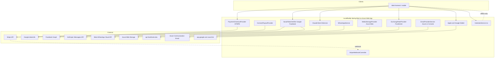
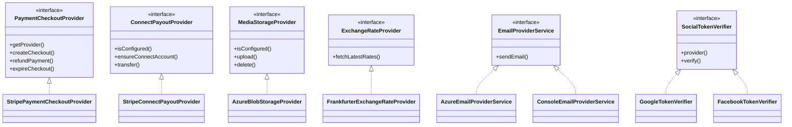
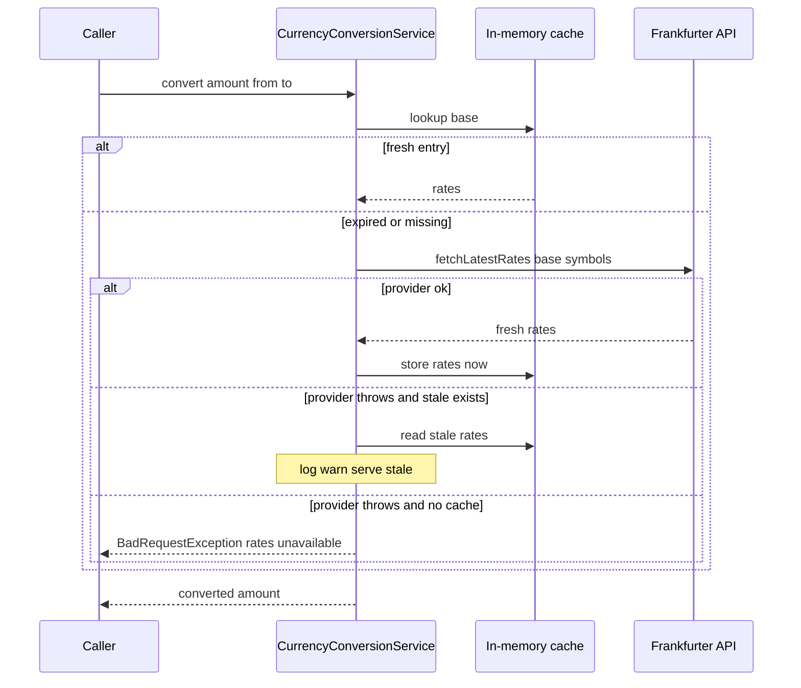
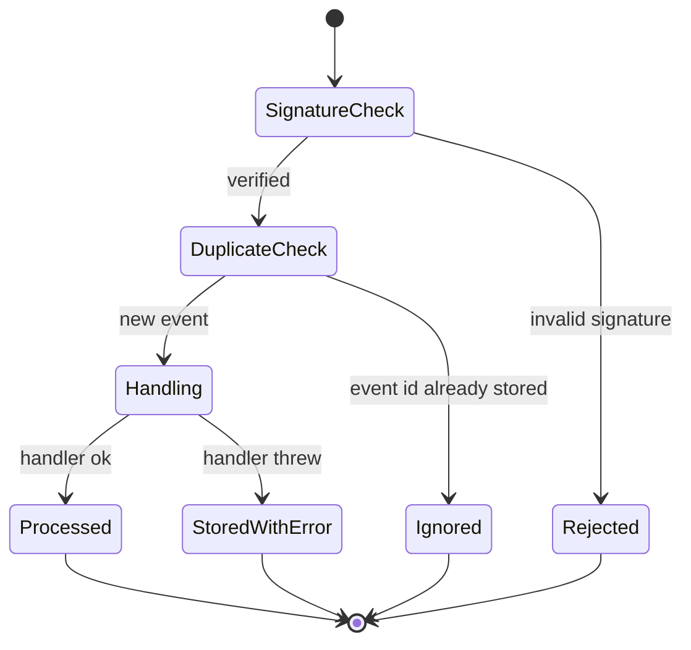

# External Integrations, Adapters & Resilience

*LocalBuddy backend architecture · June 2026*

## External integrations, adapters & resilience

> Every outbound dependency sits behind a thin port-and-adapter abstraction that is config-guarded and dormant-by-default, degrading gracefully (stale-cache, console fallback, link-only modes) rather than failing the app — but there is no formal retry/circuit-breaker layer.

### Overview

LocalBuddy talks to eight categories of external system. Each is isolated behind a thin Spring `@Component`/`@Service` adapter, and almost every one is **config-guarded and dormant-by-default**: with no credentials the bean still loads, reports `isConfigured() == false` (or has an empty `@Value` default), and the app boots cleanly for dev/test. Resilience is **bespoke per integration** — there is no shared retry, timeout, or circuit-breaker layer (a `pom.xml` / source scan finds no `resilience4j`, `spring-retry`, or `@Retryable`). The `RestClient`-based adapters use Spring's default connect/read timeouts.

### Outbound integration inventory

| Integration | Adapter class(es) | Abstraction (port) | SDK / transport | Config prefix | Configured-when | Degradation / fallback |
|---|---|---|---|---|---|---|
| Stripe Checkout + refunds | `StripePaymentCheckoutProvider` | `PaymentCheckoutProvider` | `stripe-java` 32.1.0 (`StripeClient`) | `app.payments.stripe` | `secret-key` set | **Fails fast** — `StripeClientConfig` throws at startup if key absent |
| Stripe Connect payouts | `StripeConnectPayoutProvider` | `ConnectPayoutProvider` | `stripe-java` (`accounts`, `accountLinks`, `transfers`) | `app.payments.stripe` + `app.payouts.connect` | `secret-key` set | `isConfigured()` gate; throws `BadRequestException` if called unconfigured |
| Stripe webhooks (inbound) | `StripeWebhookController` → `PaymentService` | n/a | `com.stripe.net.Webhook` | `app.payments.stripe.webhook-secret` | secret set | Throws `IllegalStateException` if secret missing; rejects bad signatures |
| Google social login | `GoogleTokenVerifier` | `SocialTokenVerifier` | `RestClient` → Google `tokeninfo` | `app.social.google.client-id` | optional (audience check skipped if blank) | Verification failure → `BadRequestException("Invalid Google token")` |
| Facebook social login | `FacebookTokenVerifier` | `SocialTokenVerifier` | `RestClient` → Graph `/me` | — | always present | Failure → `BadRequestException("Invalid Facebook token")` |
| Apple social login | *(none)* | `SocialTokenVerifier` | — | — | **never** | `SocialAuthService` returns "Sign-in with APPLE is not available yet" |
| Claude AI | `ClaudeClient` → `AiService` | concrete (no interface) | `RestClient` → Anthropic Messages API | `app.ai.anthropic` | `api-key` set | `isConfigured()` gate; moderation **fails open**; listing copy falls back to raw text |
| WhatsApp | `WhatsAppService` | concrete | `RestClient` → Meta Cloud API v21.0 | `app.whatsapp` | `access-token` + `phone-number-id` | Falls back to credential-free `wa.me` click-to-chat links |
| Azure Blob media | `AzureBlobStorageProvider` | `MediaStorageProvider` | `azure-storage-blob` 12.29.1 | `app.media.azure` | `connection-string` set | Falls back to "register external URL" endpoint; delete is best-effort no-throw |
| Frankfurter FX rates | `FrankfurterExchangeRateProvider` | `ExchangeRateProvider` | `RestClient` → `api.frankfurter.dev` | `app.currency` | always (no API key) | `CurrencyConversionService` serves **stale cache**; else `BadRequestException` |
| Email | `AzureEmailProviderService` / `ConsoleEmailProviderService` | `EmailProviderService` | `azure-communication-email` 1.0.23 | `app.email.provider` | `azure` vs `console` (default) | `@ConditionalOnProperty` selects console logger when not `azure` |
| Apple Wallet | `AppleWalletService` | concrete | BouncyCastle `bcpkix-jdk18on` 1.78.1 (PKCS#7) | `app.wallet.apple` | passTypeId+teamId+cert+wwdr | `isConfigured()`; `WalletService` omits Apple link if unconfigured |
| Google Wallet | `GoogleWalletService` | concrete | `jjwt` 0.12.6 (RS256 JWT) | `app.wallet.google` | issuerId+classId+SA email+key | `isConfigured()`; save-URL omitted if unconfigured |
| Calendar (.ics) | `CalendarService` | concrete | none (string-built RFC 5545) | — | always (offline) | n/a — pure generation, no outbound call |

### Ports-and-adapters style

The codebase applies hexagonal isolation **selectively**, where a vendor swap is genuinely plausible:

- **`PaymentCheckoutProvider`** (`payment/`) — defines `getProvider()`, `createCheckout`, `createGiftCardCheckout`, `refundPayment`, and a best-effort `expireCheckout`. The enum `PaymentProvider {STRIPE, PAYPAL, ADYEN, MANUAL}` signals intended multi-PSP support; only `STRIPE` is implemented.
- **`ConnectPayoutProvider`** (`payout/`) — `isConfigured`, `ensureConnectAccount`, `createOnboardingLink`, `transfer`. Single impl `StripeConnectPayoutProvider` (Express accounts, hosted onboarding, destination transfers).
- **`MediaStorageProvider`** (`media/`) — `isConfigured`, `upload`, `delete`, returning `StoredObject(storageKey, url)`. Single impl over Azure Blob.
- **`ExchangeRateProvider`** (`currency/`) — `fetchLatestRates(base, symbols)`. Single impl over Frankfurter; the *caching/fallback* concern lives one layer up in `CurrencyConversionService`, keeping the adapter a pure fetcher.
- **`EmailProviderService`** (`notification/email/`) — selected at wiring time by `@ConditionalOnProperty(name = "app.email.provider", havingValue = "azure" | "console")`, so there is exactly one bean and consumers (`NotificationProcessingService`) are oblivious.
- **`SocialTokenVerifier`** (`auth/`) — each verifier declares its `provider()`; `SocialAuthService` injects `List<SocialTokenVerifier>` and reduces it to a `Map<SocialProvider, SocialTokenVerifier>`, the cleanest extensibility seam in the integration layer.

By contrast, **AI, WhatsApp, both wallet services, and the calendar** are concrete services with no interface. This is a reasonable trade-off (single vendor each, no current swap pressure) but means a future second provider for any of them requires extracting an interface first.

### Resilience & graceful-degradation patterns

Each integration handles failure in its own way — there is no unifying policy:

- **Currency — stale-cache read-through (the richest pattern).** `CurrencyConversionService` keeps a `ConcurrentHashMap<String, CachedRates>` with a configurable TTL (`app.currency.cache-ttl-seconds`, default 3600). On a fresh hit it returns cached rates; on miss/expiry it calls Frankfurter; if that **throws and a stale entry exists**, it logs a warning and serves the stale rates; only with no cache at all does it raise `BadRequestException("Currency rates unavailable")`. This is the only integration with an explicit stale-fallback.
- **Email — provider substitution.** When `app.email.provider != azure`, the `ConsoleEmailProviderService` logs the message and returns a synthetic success (`console-<ts>`), so notification flows work end-to-end without a mail vendor. `AzureEmailProviderService` catches all exceptions and returns `EmailSendResult(success=false, …)` rather than throwing.
- **WhatsApp — dual-mode with a credential-free default.** `buildClickToChatLink()` produces `wa.me` deep links needing no API and no cost; `sendMessage()` (Meta Cloud API) is gated by `isConfigured()`. A code comment flags the real-world constraint that business-initiated messages outside the 24h window need approved templates.
- **Media — alternate ingestion path.** If Blob storage is unconfigured, `AzureBlobStorageProvider.upload` throws a guidance error pointing to the `registerPhotoUrl` endpoint (`ExperiencePhotoService`), letting hosts attach externally hosted image URLs. `delete()` is best-effort and never throws.
- **AI — fail-open + tolerant parsing.** `AiService.moderate()` returns `flagged=false` when the model output can't be parsed as a verdict (does **not** block content), and `generateListing()` falls back to using raw model text as the description. `tryParseJson` strips Markdown code fences and extracts the first `{…}`.
- **Best-effort no-throw operations.** `StripePaymentCheckoutProvider.expireCheckout` (called from `BookingExpiryService` line ~123) and `AzureBlobStorageProvider.delete` swallow all exceptions by contract — the session/blob may already be gone.
- **Async decoupling for notifications.** Email/WhatsApp sends never run on the request thread. `NotificationProcessor` polls `PENDING` rows every `app.notifications.processor-delay-ms` (10s) in batches of 20; `NotificationProcessingService` transitions each row `PENDING → PROCESSING → SENT/FAILED/SKIPPED` (`findByIdForUpdate` row-lock), persisting `failureReason`. There is no automatic re-enqueue of `FAILED` rows.

> **Resilience gap worth flagging to the architect:** outbound calls have no explicit timeouts beyond `RestClient`/SDK defaults, no retry/backoff, and no circuit breaker. A slow Anthropic, Frankfurter, Graph, or Stripe endpoint will tie up the calling thread (notification scheduler or request thread) for the default read timeout. The notification poller mitigates this for email/WhatsApp; synchronous paths (AI endpoints, currency, social login, checkout creation) do not benefit.

### Stripe deep-dive: signature, idempotency, money safety

- **Inbound integrity.** `StripeWebhookController` reads the raw body + `Stripe-Signature` header and calls `Webhook.constructEvent(payload, sig, webhookSecret)`; a `SignatureVerificationException` becomes a 400. Missing webhook secret → `IllegalStateException`.
- **Idempotency.** `PaymentService.handleStripeWebhookEvent` short-circuits on `existsByProviderAndProviderEventId(STRIPE, eventId)` and returns "Duplicate webhook ignored", persisting every event into `payment_webhook_events` with `raw_payload`, `processed`, and `processing_error`. Handler exceptions are caught and stored as `processing_error` (the event is recorded, not retried).
- **Handled event types.** `checkout.session.completed` (branches on `giftCardId` metadata → `GiftCardService.activatePurchasedCard`, else `markPaymentPaidFromStripeSession`), plus `checkout.session.expired` / `checkout.session.async_payment_failed` → release the held seat. Sessions carry `paymentId`/`bookingId`/`giftCardId` in `metadata` and a `clientReferenceId` for correlation.
- **Money-handling specifics.** Amounts are converted to integer cents via `movePointRight(2).longValueExact()`; the customer is charged only the non-gift-card remainder; refund reasons are mapped to Stripe's enum; checkout sessions get `expiresAt = now + 31min` (Stripe's 30-min floor) while the booking expiry job proactively expires them earlier.

### Configuration toggles (env-driven)

All integrations are wired from `application.yaml` via `${ENV:default}` placeholders, so production is configured purely through environment variables (Azure App Service):

| Capability | Key env var(s) | Effect when unset |
|---|---|---|
| Stripe | `STRIPE_SECRET_KEY`, `STRIPE_WEBHOOK_SECRET` | **App fails to start** (StripeClientConfig) |
| Email provider | `EMAIL_PROVIDER` (`console`/`azure`), `AZURE_COMMUNICATION_CONNECTION_STRING` | console logger (default) |
| Media | `AZURE_BLOB_CONNECTION_STRING`, `AZURE_BLOB_CONTAINER`, `AZURE_BLOB_PUBLIC_BASE_URL` | upload disabled, external-URL path only |
| WhatsApp | `WHATSAPP_ACCESS_TOKEN`, `WHATSAPP_PHONE_NUMBER_ID` | wa.me links only |
| AI | `ANTHROPIC_API_KEY`, `ANTHROPIC_MODEL`, `ANTHROPIC_BASE_URL`, `ANTHROPIC_MAX_TOKENS` | AI endpoints return "not available yet" |
| Currency | `app.currency.provider-base-url`, `app.currency.supported`, `app.currency.cache-ttl-seconds` | live (no key needed) |
| Social | `GOOGLE_CLIENT_ID` | Google audience check skipped (still works); Apple always disabled |
| Apple Wallet | `APPLE_WALLET_PASS_TYPE_ID/TEAM_ID/CERT_BASE64/CERT_PASSWORD/WWDR_BASE64` | Apple pass disabled |
| Google Wallet | `GOOGLE_WALLET_ISSUER_ID/CLASS_ID/SA_EMAIL/SA_PRIVATE_KEY/ORIGIN` | Google save-link disabled |

### Wallet & calendar: in-process generation (no issue-time round-trip)

- **Apple (`AppleWalletService`)** builds an event-ticket `pass.json` + generated icons, a SHA-1 `manifest.json`, and a **detached PKCS#7 signature** via BouncyCastle (`CMSSignedDataGenerator`, `SHA256withRSA`), loading the Pass Type ID cert from a base64 `.p12` and chaining the Apple WWDR cert, then zips a `.pkpass`. No Apple network call.
- **Google (`GoogleWalletService`)** builds a generic-pass object and signs a `savetowallet` JWT (RS256 via `jjwt`, service-account private key) returning a `https://pay.google.com/gp/v/save/<jwt>` link.
- **Calendar (`CalendarService`)** emits RFC-5545 `.ics` (with proper escaping) and builds Google/Outlook "add to calendar" deep links entirely offline; `googleCalendarLink(booking)` is reused inside booking-confirmation messages.
- `WalletService`/`CalendarService` both enforce participant authorization (traveler or host) and return 404 on mismatch to avoid booking-ID enumeration.

### Deployment context

Outbound calls originate from a single Spring Boot service deployed to **Azure Web App** (`.github/workflows/azure-webapp.yml`, JDK 21, `azure/webapps-deploy@v3`, `workflow_dispatch` only). Inbound Stripe webhooks land on `POST /api/public/payments/webhooks/stripe`. Health is exposed via `management.endpoints … health,info`, but the **Redis health indicator is disabled** and no health checks exist for the external dependencies themselves.

### Notable gaps / risks for the architect

- No timeouts/retries/circuit-breakers on any outbound call (default `RestClient`/SDK timeouts only).
- Failed notifications (`FAILED` status) are not automatically retried; they require manual/operator intervention.
- Failed Stripe webhook handlers are stored with `processing_error` but not re-driven; reconciliation relies on Stripe's own redelivery hitting the idempotency guard.
- AI client lacks Anthropic prompt-caching, streaming, or token accounting; a single blocking call per request with a fixed `max-tokens`.
- `AppleWalletService` generates a flat-colour placeholder icon and includes only `icon`/`icon@2x` (no logo/strip), which Apple may reject in production — verify against Wallet requirements before launch.

### Diagrams

#### Integration context diagram

#### Adapter ports and config-guard structure

#### Currency stale-cache fallback

#### Stripe webhook idempotent processing

### Key architectural decisions & trade-offs

- Ports-and-adapters only where a swap is plausible: payments (PaymentCheckoutProvider), payouts (ConnectPayoutProvider), media (MediaStorageProvider), exchange rates (ExchangeRateProvider), email (EmailProviderService), social auth (SocialTokenVerifier). AI, WhatsApp, wallet, and calendar are concrete services with no interface — accepted because there is currently a single vendor each.
- Config-guarded, dormant-by-default integrations: every paid/credentialed adapter exposes isConfigured() (or an empty @Value default) so the app boots and runs in dev/test with zero external credentials. Stripe is the one exception — StripeClientConfig fails fast at startup if the secret key is absent.
- Graceful degradation is bespoke per integration rather than a shared resilience policy: currency serves a stale in-memory cache on provider failure; email falls back to a console logger; WhatsApp falls back to credential-free wa.me click-to-chat links; media falls back to a register-external-URL endpoint; AI moderation fails-open. No resilience4j / spring-retry / circuit breaker is present.
- Stripe webhook integrity + idempotency: signatures are verified with the Stripe SDK (Webhook.constructEvent) and replays are de-duplicated by persisting every event in payment_webhook_events keyed on (provider, provider_event_id). Webhook processing swallows handler exceptions, storing processing_error so a failed event is recorded rather than retried automatically.
- Outbound adapter failures are uniformly wrapped in the domain BadRequestException (HTTP 400) instead of surfacing as 5xx, and best-effort operations (expireCheckout, blob delete) deliberately never throw.
- Social-login extensibility via Spring collection injection: SocialAuthService builds a Map<SocialProvider, SocialTokenVerifier> from all beans, so adding a provider is just adding a bean. APPLE is enumerated but has no verifier, so it returns a graceful 'not available yet' error.
- Notifications are processed asynchronously out-of-band by a DB-polling scheduler (NotificationProcessor every 10s), decoupling the request thread from email/WhatsApp provider latency; unsupported channels (SMS) are marked SKIPPED, not failed.
- Wallet passes are generated in-process (no vendor round-trip at issue time): Apple .pkpass is PKCS#7-signed locally via BouncyCastle; Google Wallet is an RS256 JWT save-link via jjwt — both dormant until certs/keys are configured.

---

[← back to the architecture index](./README.md)
