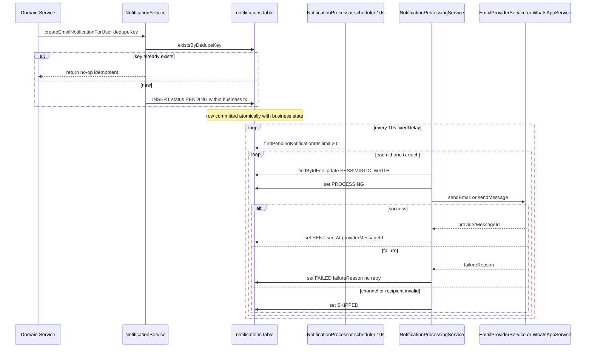
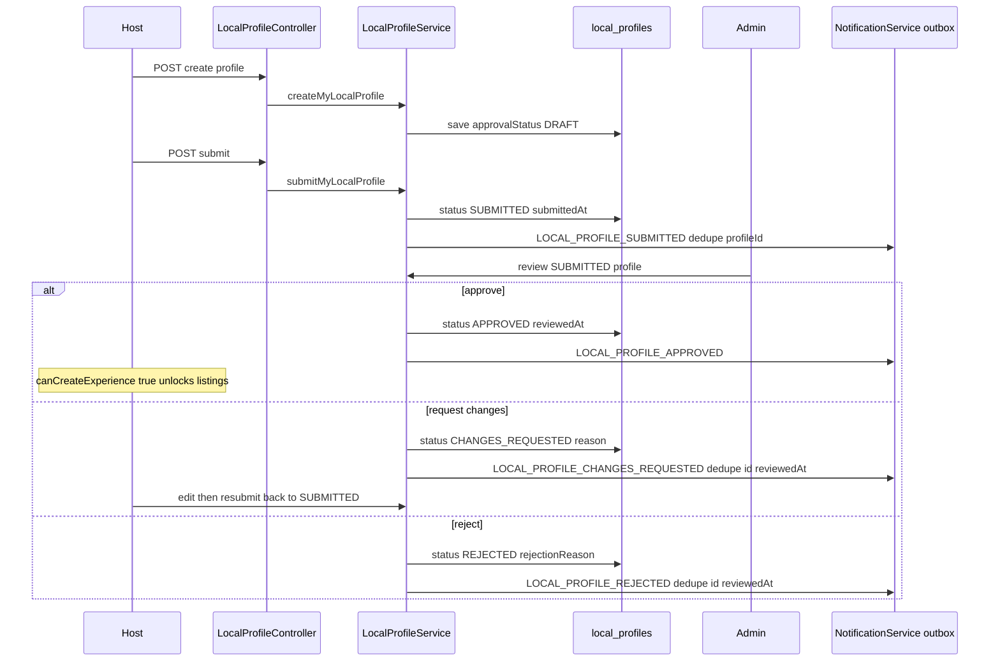
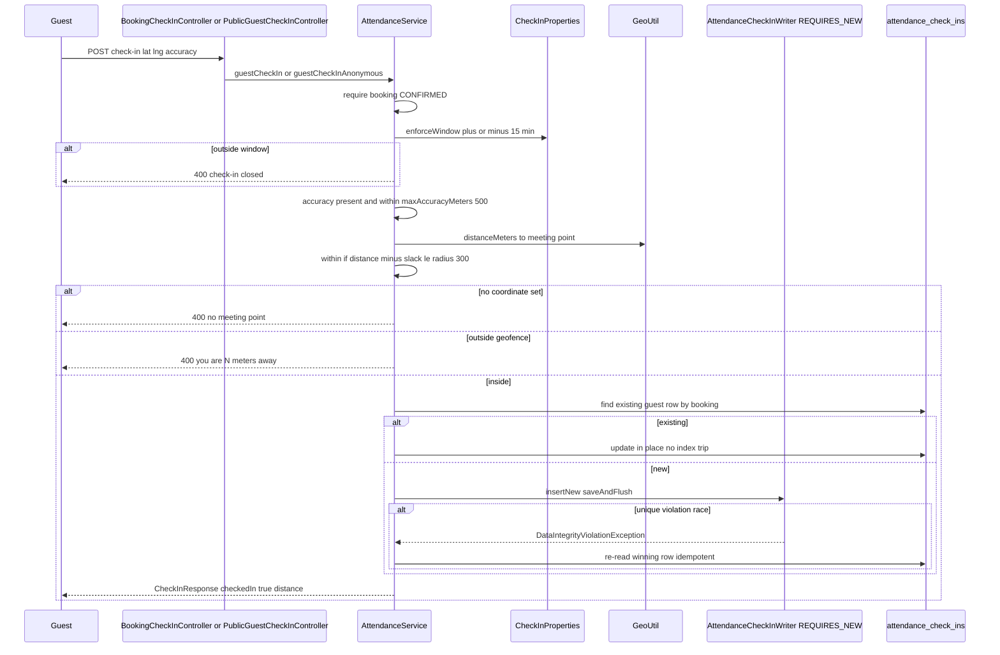
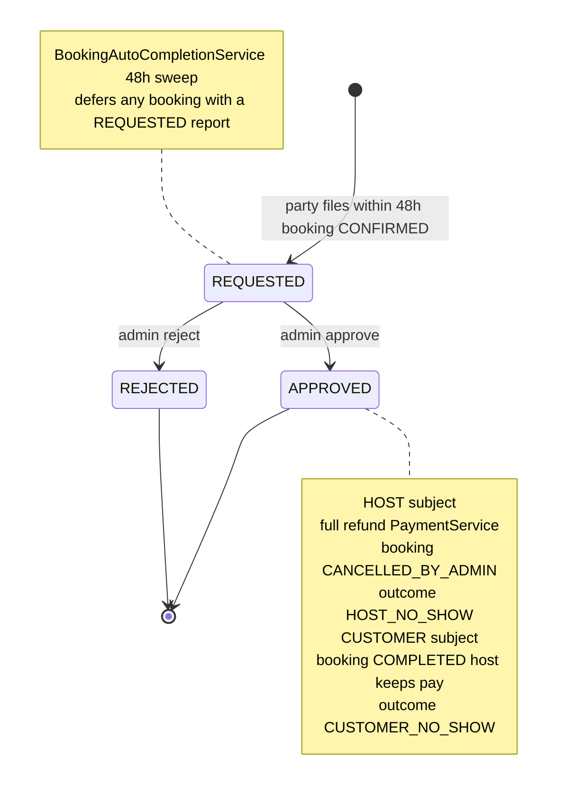
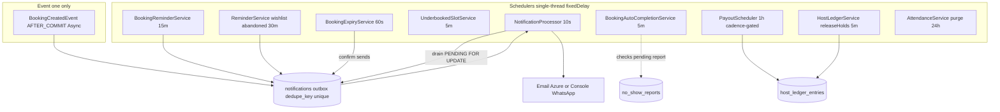

# End-to-End Flows, Eventing & Observability

*LocalBuddy backend architecture · June 2026*

## End-to-end flows, eventing, async & observability

> A single-instance Spring Boot monolith stitches cross-domain journeys together with a transactional-outbox notification table drained by a polling worker, an in-process AFTER_COMMIT event for booking creation, and ~11 fixed-delay @Scheduled sweeps — all idempotent via DB dedupe keys and partial unique indexes, but with no distributed locking, retries, dead-lettering, or tracing.

### Scope and System Shape

This lens covers the reliability backbone that ties LocalBuddy's domains together: the **notification outbox + polling delivery worker**, the **scheduled-job fleet**, the **in-process eventing**, the **geo check-in / attendance** subsystem, the **no-show report → verification → refund** flow, the **host onboarding → submission → approval → listing** journey, and the system's **error/retry and observability posture**.

The architecture is a **single-deployment Spring Boot 3 / Java 21 monolith** on Azure Web App (`.github/workflows/azure-webapp.yml`) backed by one Postgres (HikariCP, `maximum-pool-size: 5`). There is **no message broker, no queue, and no distributed coordination**. All asynchrony is achieved with two primitives only:

1. **An outbox table** (`notifications`) written transactionally and drained by a poller.
2. **Spring `@Scheduled` fixed-delay sweeps** plus a single in-process `@TransactionalEventListener`.

`@EnableScheduling` and `@EnableConfigurationProperties` live on `LocalbuddyBackendApplication`; `@EnableAsync` lives on `config/AsyncConfig` (an empty marker — **no custom `TaskExecutor` bean is defined**, so `@Async` uses Spring's default `SimpleAsyncTaskExecutor`, which spawns an unbounded new thread per call rather than a bounded pool).

---

### The Notification Outbox

The notification subsystem is a textbook **transactional outbox**, and it is the single most important reliability mechanism in the codebase.

#### Write side — `NotificationService`

Domain code never calls an email/SMS provider directly. Instead it calls one of the typed emitters on `notification/NotificationService`:

| Method | Channel | Recipient |
|---|---|---|
| `createEmailNotificationForUser` | `EMAIL` | logged-in `User` |
| `createEmailNotificationForGuest` | `EMAIL` | anonymous guest email |
| `createInAppNotificationForUser` | `IN_APP` | logged-in `User` |
| `createEmailAndInAppNotificationForUser` | both | fan-out, suffixes dedupe key with `:EMAIL` / `:INAPP` |
| `createWhatsAppNotificationForUser` / `...ForGuest` | `WHATSAPP` | phone-bearing recipient |

Each call inserts a `Notification` row in state `PENDING` **inside the caller's transaction**, so the message is committed atomically with the business state change (e.g. a booking, an approval). Channels are `notification/NotificationChannel` and types are the 30-value `notification/NotificationType` enum (`BOOKING_CREATED`, `LOCAL_PROFILE_APPROVED`, `HOST_ARRIVED`, `BOOKING_REMINDER`, etc.).

**Idempotency is the load-bearing design choice.** Every emission carries a deterministic `dedupeKey` persisted under a `UNIQUE` column (`Notification.dedupeKey`, `length=255`). `createNotification` guards twice:

```
if (notificationRepository.existsByDedupeKey(dedupeKey)) return;   // fast path
...
try { notificationRepository.save(notification); }
catch (DataIntegrityViolationException ex) { /* race: another tx won, ignore */ }
```

Dedupe keys are constructed from the entity and a stage/role discriminator, e.g.:
- `BOOKING_CREATED:LOCAL:<bookingId>` and `BOOKING_CREATED:TRAVELER:<bookingId>` (`BookingNotificationService`)
- `BOOKING_CONFIRMED:<bookingId>` / `...:WHATSAPP` (`BookingConfirmationNotifier`)
- `HOST_ARRIVED:<bookingId>` (`AttendanceService.notifyGuestsHostArrived`)
- `LOCAL_PROFILE_APPROVED:<profileId>`, `LOCAL_PROFILE_REJECTED:<profileId>:<reviewedAt>` (`LocalProfileService`)
- `booking-reminder:<bookingId>` (`BookingReminderService`), `wishlist-reminder:<itemId>:<stage>h:<channel>`, `abandoned-booking:<bookingId>:<stage>h:<channel>` (`ReminderService`)

This is what lets the schedulers run frequently and overlap without spamming — emission is **at-least-once**, but the row is **exactly-once**. No per-row "sent" flag is needed.

#### Read/drain side — `NotificationProcessor` + `NotificationProcessingService`

`NotificationProcessor.processPendingNotifications()` runs `@Scheduled(fixedDelay 10s, key app.notifications.processor-delay-ms)`. Each tick:

1. `findPendingNotificationIds(PENDING)` (JPQL, ordered `createdAt asc`), capped to `BATCH_SIZE = 20` in memory.
2. For each id, delegates to `NotificationProcessingService.processOneNotification(id)` — **one transaction per notification** so a single failure never poisons the batch.

`processOneNotification` selects the row `FOR UPDATE` via `findByIdForUpdate` (`@Lock(PESSIMISTIC_WRITE)`), re-checks it is still `PENDING` (guards against a concurrent picker), flips it to `PROCESSING`, then dispatches by channel:

- `IN_APP` → marked `SENT` immediately (delivered by being persisted; read through the feed).
- `EMAIL` → `EmailProviderService.sendEmail(...)`; `SENT` + `providerMessageId` on success, `FAILED` + `failureReason` on failure, `SKIPPED` if recipient email missing.
- `WHATSAPP` → `SKIPPED` if `WhatsAppService.isConfigured()` is false or phone missing, else best-effort send (note: free-form WhatsApp only delivers inside a 24h session; templates are a documented TODO).
- any other channel → `SKIPPED`.

`NotificationStatus` is `PENDING | PROCESSING | SENT | FAILED | SKIPPED`.

#### Provider abstraction

`EmailProviderService` has two `@ConditionalOnProperty(app.email.provider=...)` implementations: `AzureEmailProviderService` (Azure Communication Services, synchronous `SyncPoller.waitForCompletion()`) and `ConsoleEmailProviderService` (dev default, `app.email.provider=console`). The Azure send is **blocking inside the worker transaction**, so a slow provider holds the row lock and a worker thread for the duration.

#### Reliability gaps (outbox)

- **No retry / backoff / max-attempts.** A `FAILED` row is terminal; the poller only ever picks `PENDING`. A transient provider blip permanently drops the message.
- **No `PROCESSING` reclaim / lease.** If the app dies after flipping to `PROCESSING` but before the provider returns, the row is stranded — no visibility timeout sweeps it back to `PENDING`.
- **No dead-letter queue or alerting.** Failures are discoverable only by querying `notifications WHERE status='FAILED'`.
- **Batch is fetch-all-then-`limit(20)`:** `findPendingNotificationIds` returns *all* pending ids and trims in Java, so a large backlog loads every id each tick.

---

### Eventing

There is exactly **one application event**: `booking/BookingCreatedEvent(UUID bookingId)`, published by `BookingService` (lines ~245 logged-in, ~812 guest) via `ApplicationEventPublisher`. `BookingNotificationEventListener` consumes it with:

```
@Async
@TransactionalEventListener(phase = TransactionPhase.AFTER_COMMIT)
public void onBookingCreated(BookingCreatedEvent event) { ... }
```

`AFTER_COMMIT` ensures the booking row is durable before fan-out; `@Async` moves fan-out off the request thread. `BookingNotificationService.createBookingCreatedNotifications` then writes the outbox rows (host "new booking", traveler/guest "complete payment").

**Everything else is direct synchronous invocation**, not eventing: `LocalProfileService` calls `NotificationService` inline on approve/reject; `AttendanceService` calls it inline on host arrival; `BookingConfirmationNotifier.sendConfirmation` is called directly by `BookingExpiryService` when a payment lands. So the system is effectively **one event + an outbox**, not an event-driven architecture. A consequence: because `@Async` AFTER_COMMIT runs in a *new* transaction with no request context, a failure there is logged-and-lost — there is no compensation for a dropped fan-out (though the outbox rows it writes are themselves durable once committed).

---

### Scheduled Jobs (the async backbone)

Eleven `@Scheduled` fixed-delay methods carry all time-driven behavior. All share the **default single-threaded scheduler** (no `TaskScheduler`/pool bean), so they execute serially; a long job delays the next.

| Job (class.method) | Default delay | Config key | Responsibility / idempotency |
|---|---|---|---|
| `NotificationProcessor.processPendingNotifications` | 10s | `app.notifications.processor-delay-ms` | Drain outbox; idempotent via row status + `FOR UPDATE` |
| `BookingExpiryService.expirePendingPaymentBookings` | 60s | `app.booking.expiry-processor-delay-ms` | Expire unpaid `PENDING_PAYMENT`, release seats, cancel Stripe session; confirms if paid |
| `BookingAutoCompletionService.autoCompletePastBookings` | 5m | `app.booking.auto-complete-processor-delay-ms` | Complete confirmed bookings 48h post-start; **skips any with a pending no-show report** |
| `UnderbookedSlotService` (sweep) | 5m | `app.booking.underbooked-processor-delay-ms` | Min-guests-to-confirm / underbooked notices |
| `HostLedgerService.releaseHolds` | 5m | `app.payout.ledger-release-delay-ms` | Move ledger entries `PENDING`→`AVAILABLE` past `available_at` |
| `PayoutScheduler.runScheduledPayouts` | 1h | `app.payout.processor-delay-ms` | Pay hosts on cadence (`WEEKLY/BIWEEKLY/MONTHLY`); per-host try/catch |
| `BookingReminderService.sendUpcomingBookingReminders` | 15m | `app.notifications.reminder-processor-delay-ms` | One reminder per confirmed booking in lead window (24h); dedupe-keyed |
| `ReminderService.sendWishlistReminders` | 30m | `app.reminders.processor-delay-ms` | Wishlist nudges at 2/24/48h offsets, suppressed if engaged |
| `ReminderService.sendAbandonedBookingReminders` | 30m | `app.reminders.processor-delay-ms` | Nudge `EXPIRED` bookings to re-book |
| `AttendanceService.purgeExpiredCheckIns` | 24h | `app.checkin.retention-processor-delay-ms` | GDPR-style purge of check-ins > 90 days |

**Notable patterns:**
- **Bounded batches** (`findTop100By...`, `findTop200By...`, `findTop500By...`) cap each sweep and rely on the next tick to make progress — a deliberate throughput-vs-fairness trade.
- **Polling-on-a-cadence** for payouts: the job runs hourly but `isPayoutDay()` no-ops except on the cadence day; once paid, balances drop below `minimum-amount` so repeat runs are inert.
- **No distributed lock (no ShedLock).** Safe under one instance only. The booking/payout sweeps lean on **row-level `SELECT ... FOR UPDATE`** (`AvailabilitySlotRepository.findByIdForUpdate`) for correctness, not job-level locking — but two instances would still double-fire reminders and payouts.

---

### Host Onboarding → Submission → Approval → Listing

State lives on `localprofile/LocalProfile.approvalStatus` (`LocalApprovalStatus`): `DRAFT → SUBMITTED → {APPROVED | CHANGES_REQUESTED | REJECTED} → ...`, plus a terminal `BLOCKED`. `LocalProfileService` enforces all transitions; each emits exactly one outbox notification.

| Action | Method | From → To | Notification type / dedupe |
|---|---|---|---|
| Create profile | `createMyLocalProfile` | (none) → `DRAFT` | — (`verificationStatus=NOT_STARTED`) |
| Submit | `submitMyLocalProfile` | `DRAFT/CHANGES_REQUESTED/REJECTED` → `SUBMITTED` | `LOCAL_PROFILE_SUBMITTED:<id>` |
| Edit while approved | `updateMyLocalProfile` | `APPROVED` → `SUBMITTED` (re-review, sets `resubmittedAt`) | — |
| Admin approve | `approveLocalProfile` | `SUBMITTED` → `APPROVED` | `LOCAL_PROFILE_APPROVED:<id>` |
| Admin request changes | `requestChangesForLocalProfile` | `SUBMITTED` → `CHANGES_REQUESTED` | `LOCAL_PROFILE_CHANGES_REQUESTED:<id>:<reviewedAt>` |
| Admin reject | `rejectLocalProfile` | `SUBMITTED` → `REJECTED` | `LOCAL_PROFILE_REJECTED:<id>:<reviewedAt>` |

Only `APPROVED` unlocks `canCreateExperience` (surfaced by `getMyOnboardingStatus` → `LocalOnboardingStatusResponse`). Re-submitting after `CHANGES_REQUESTED`/`REJECTED` clears the prior `reviewedAt`/reason fields and resets review state. The dedupe keys for changes/reject include `reviewedAt`, so a *second* review cycle correctly produces a *new* notification (unlike submit/approve which are once-per-profile).

---

### Geo Check-in / Attendance

`attendance/AttendanceService` implements an **asymmetric trust geofence**, configured by `CheckInProperties` (`app.checkin.*`): 15-min before/after window, 300m geofence radius, 500m worst-trusted GPS accuracy, 90-day retention.

- **Guest check-in is hard-gated.** Booking must be `CONFIRMED`; `enforceWindow` checks the ±15-min slot window; `accuracyMeters` must be present and ≤ `maxAccuracyMeters`; `evaluateGeofence` requires `(distance − accuracySlack) ≤ radius`. Failures throw `BadRequestException` with human-readable distance/accuracy guidance. Two entry points: authenticated (`guestCheckIn`, `POST /api/bookings/{id}/check-in`) and anonymous-by-reference+email (`guestCheckInAnonymous`, `POST /api/public/check-in`).
- **Host check-in is soft.** `hostCheckIn` (`POST /api/host/slots/{slotId}/check-in`, multipart) is **never rejected for distance** — it records a warning + measured distance, optionally stores an arrival photo via `MediaStorageProvider`, then calls `notifyGuestsHostArrived` to emit `HOST_ARRIVED` notifications to every confirmed booking.
- **Host roster + show/no-show.** `getSlotAttendance` builds a `SlotAttendanceResponse`; `markGuestAttendance` sets `Booking.guestShowStatus` (`GuestShowStatus`, distinct from the admin `attendanceOutcome`).

**Concurrency hardening (the most sophisticated bit of the codebase):** the V23 **partial unique indexes** `uq_attendance_host_per_slot` (`WHERE role='HOST'`) and `uq_attendance_guest_per_booking` (`WHERE role='GUEST' AND booking_id IS NOT NULL`) guarantee one row per slot/booking. A racing double-submit is handled by `saveHandlingConcurrentInsert`: existing rows are updated in-place (no insert, no index trip); brand-new rows are inserted by `AttendanceCheckInWriter.insertNew` under `@Transactional(propagation = REQUIRES_NEW)` + `saveAndFlush`, so a unique-violation rolls back **only the nested tx** and the caller recovers idempotently by re-reading the winning row (avoiding Spring's `UnexpectedRollbackException` poisoning).

Check-ins are explicitly **operational signal, not refund proof**, and `purgeExpiredCheckIns` deletes them after `retentionDays`.

---

### No-Show: Report → Verification → Refund

`noshow/NoShowService` runs a **human-in-the-loop** dispute flow; `NoShowReportStatus` is `REQUESTED | APPROVED | REJECTED`, subject is `NoShowSubject` (`HOST | CUSTOMER`).

1. **File** (`reportNoShow` for logged-in party at `POST /api/no-show/bookings/{id}/report`; `reportHostNoShowAsGuest` for anonymous guests at `POST /api/public/guest-no-show/report`). `validateReportable` requires `CONFIRMED` status, experience already started, within the **48h `REPORT_WINDOW_HOURS`**, and no existing open/approved report for the same subject. Non-parties get a `ResourceNotFoundException` (existence-hiding IDOR guard). A customer report targets `HOST`; a host report targets `CUSTOMER`.
2. **Admin verify** (`GET/POST /api/admin/no-show/reports...`). `approve`:
   - `HOST` no-show → `PaymentService.fullyRefundBookingPayment(...)`, `attendanceOutcome=HOST_NO_SHOW`, status → `CANCELLED_BY_ADMIN`. **This is the only async-adjacent path that moves money automatically.**
   - `CUSTOMER` no-show → informational; booking → `COMPLETED` (host keeps payment).
   `reject` simply closes the report. `removeFlag` clears the flag without reversing a refund.
3. **Auto-completion interplay.** `BookingAutoCompletionService` completes confirmed bookings 48h post-start but **defers any booking with a `REQUESTED` report** (`existsByBookingIdAndStatus`) so the admin decision wins. This coupling between two independently-scheduled jobs is the key correctness invariant of the no-show flow.

---

### Observability, Error Handling & Retry Posture

**Observability is minimal:**
- **Actuator** exposes only `health` and `info` (`management.endpoints.web.exposure.include: health,info`), with `health.show-details: never` and the Redis health indicator disabled. **No Prometheus/metrics endpoint, no Micrometer registry, no custom health indicators** for the outbox/queue depth.
- **Logging** is SLF4J/Logback to stdout: `root: INFO`, `com.localbuddy: DEBUG`, Hibernate SQL `WARN`. There is **no correlation/request ID, no MDC enrichment, and no distributed tracing** (`JwtAuthenticationFilter` is the only `OncePerRequestFilter`; it does not set MDC). Cross-async correlation (request → AFTER_COMMIT listener → outbox row → 10s-later worker) is therefore manual.
- **Ad-hoc timing logs** exist on hot booking paths (`LOGGED_IN_BOOKING_TIMING publishEventMs=...`, `GUEST_BOOKING_TIMING ...`) and scheduler info logs (`purgeExpiredCheckIns`, payout warnings) — useful but unstructured.

**Error/retry posture is fail-soft:**
- `GlobalExceptionHandler` (`@RestControllerAdvice`) maps domain exceptions to a uniform `ErrorResponse` (timestamp/status/error/message/path). The catch-all `Exception` handler returns a generic 500 with **no stack trace in the response** (good) but **also does not log the exception** in the handler itself (observability gap — the stack only surfaces via Spring's default logging).
- **No retry anywhere in the async layer.** The outbox worker never re-attempts `FAILED`; schedulers do not retry failed rows; `PayoutScheduler` swallows per-host failures with a `log.warn` and moves on. Resilience comes purely from **next-tick re-polling of still-eligible rows** plus DB idempotency, not from explicit retry/backoff machinery.
- **Single-instance assumption** is the overarching trade-off: no ShedLock, no leader election, no queue. It is operationally simple and cheap but blocks horizontal scaling without first adding distributed locking to the scheduler fleet.

### Diagrams

#### Notification Outbox Worker Lifecycle



#### Host Onboarding to Admin Approval



#### Guest Geofenced Arrival Check-in



#### No-Show Report to Verification to Refund



#### Scheduled Job Fleet and Outbox Backbone



### Key architectural decisions & trade-offs

- Transactional outbox for delivery: notifications are persisted as PENDING rows in the notifications table inside the business transaction, then drained asynchronously by a polling NotificationProcessor (fixedDelay 10s). This decouples delivery from request latency and survives provider outages, at the cost of up to ~10s delivery delay.
- Idempotency is pushed entirely to the database. Every emission carries a deterministic dedupeKey with a UNIQUE constraint (notifications.dedupe_key); duplicates are swallowed via existsByDedupeKey plus a DataIntegrityViolationException catch. Schedulers can therefore run as often as they like (at-least-once emission, exactly-once row).
- Eventing is minimal and in-process: only BookingCreatedEvent exists, delivered via @TransactionalEventListener(AFTER_COMMIT) + @Async so notification fan-out runs after the booking commits and off the request thread. All other 'events' are direct synchronous service calls or scheduler polls — there is no message broker.
- Scheduling is built on plain @Scheduled fixedDelay with the default single-threaded scheduler; ~11 jobs share one thread. There is NO ShedLock / distributed lock, so the design implicitly assumes a single app instance. Horizontal scaling would cause duplicate scheduler runs (mostly safe due to dedupe keys, but payouts/expiry rely on row-level pessimistic locks, not job-level locks).
- Concurrency on attendance check-ins is handled with V23 partial unique indexes (uq_attendance_host_per_slot, uq_attendance_guest_per_booking) plus a REQUIRES_NEW nested insert (AttendanceCheckInWriter) so a racing double-submit fails only the nested tx and the caller recovers by re-reading the winning row.
- Geofence trust model is asymmetric: guests are hard-gated (must be inside the error-adjusted geofence with trustworthy GPS accuracy <= 500m), hosts are never rejected for distance (soft check-in with a warning). Check-ins are explicitly operational signal, not refund proof, and are purged after 90 days.
- No-show resolution is human-in-the-loop: either party files within 48h, an admin verifies; HOST no-show triggers a full automated refund via PaymentService and CANCELLED_BY_ADMIN, CUSTOMER no-show is informational. A separate BookingAutoCompletionService auto-completes confirmed bookings 48h after start, but defers any booking with a still-pending report.
- Error/retry posture is fail-soft, not retrying. A failed email/WhatsApp send marks the row FAILED with a failure_reason and is never retried by the worker (no backoff, no max-attempts, no dead-letter); PROCESSING rows that crash mid-flight are also never reclaimed. Operability depends on querying the notifications table by status.
- Observability is thin: Actuator exposes only health and info, logging is SLF4J/Logback to stdout at DEBUG for com.localbuddy with no correlation/trace IDs, no Micrometer metrics registry, and no distributed tracing. Some hot paths emit ad-hoc timing logs (LOGGED_IN_BOOKING_TIMING, GUEST_BOOKING_TIMING).


---


[← back to the architecture index](./README.md)
