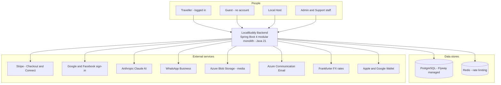

# LocalBuddy — Backend Architecture & Design

*Architecture documentation set · June 2026*

This set documents the architecture and design of the LocalBuddy backend for a senior software-architect audience. It was produced by auditing the live codebase (538 Java source files, 53 JPA entities, 24 Flyway migrations) across eight architectural lenses, so every claim and diagram is grounded in the source, not the roadmap. Diagrams are [Mermaid](https://mermaid.live) and render natively on GitHub, in VS Code, and at mermaid.live.

## Architecture in one paragraph

LocalBuddy is a **modular monolith**: a single Spring Boot 4 / Java 21 fat-JAR organised into ~45 feature packages under `com.localbuddy`, each following a `controller → service → repository → @Entity` layering with shared cross-cutting concerns (`auth`, `config`, `common`, `audit`, `ratelimit`). State lives in **PostgreSQL** (schema owned by JPA entities, applied by **Flyway**, validated by Hibernate at boot); **Redis** backs rate-limiting only. Authentication is **stateless JWT** (plus Google/Facebook social login) with role-based authorization and a first-class **guest (no-account)** identity. The commercial core is a **money engine** — a pure-`BigDecimal` pricing calculator that splits a guest service fee from host commission with VAT and configurable discount cost-bearer, wired to **Stripe** hosted Checkout + webhooks for payment and **Stripe Connect** for host payouts, with refunds + proportional clawback and VAT invoicing, all holding a cash-conservation invariant. Background work (notifications, reminders, payout runs, booking expiry) runs **in-process** via nine `@Scheduled` pollers over a transactional **outbox**. It is deployed as a plain JAR to an **Azure Web App** via a manually-triggered GitHub Actions workflow.

## System context

## The documents

| # | Document | What it covers |
| --- | --- | --- |
| 1 | [System Architecture — Stack, Runtime & Modules](./01-system-architecture.md) | Tech stack, runtime/process model, build & Azure deployment, modular-monolith package map, layering, cross-cutting concerns. |
| 2 | [Data Architecture & Domain Model](./02-data-model.md) | Domain model & ER diagram, the ~50-table schema by domain, JPA mapping, money/geo columns, retention. |
| 3 | [Security, Identity, Consent & Data Protection](./03-security-and-identity.md) | AuthN (JWT + social), role-based authZ, CORS, rate-limiting, versioned consent, GDPR export/erasure, audit, guest identity, known gaps. |
| 4 | [Money — Pricing Engine, Payments, Payouts & Invoicing](./04-money-and-payments.md) | Pricing engine, Stripe Checkout + webhooks, Stripe Connect payouts, refunds + clawback, invoicing, the cash-conservation invariant. |
| 5 | [Booking, Availability, Concurrency & Lifecycle](./05-booking-and-concurrency.md) | Availability & capacity, pessimistic seat-reservation locking, the booking state machine and every transition, scheduled jobs. |
| 6 | [External Integrations, Adapters & Resilience](./06-integrations.md) | Every outbound integration (Stripe, social auth, Claude, WhatsApp, Azure Blob, Frankfurter, email, wallet) as ports-and-adapters with fallbacks. |
| 7 | [End-to-End Flows, Eventing & Observability](./07-key-flows.md) | End-to-end sequence diagrams (onboarding→approval, geo check-in, no-show→refund) and the notification outbox / scheduled-job backbone. |

## Consolidated architectural decisions & trade-offs

A cross-cutting register of the notable decisions surfaced by the audit (see each document for context).

### System Architecture — Stack, Runtime & Modules
- Monolithic fat-JAR over containers: build produces a single executable Spring Boot JAR (localbuddy-backend-0.0.1-SNAPSHOT.jar) deployed directly to Azure Web App via azure/webapps-deploy; no Dockerfile or docker-compose exists in the repo.
- Spring Boot 4.0.6 on the bleeding edge (Jakarta EE, spring-boot-starter-webmvc/-flyway naming), pinning Java 21 as the language level but compiling Kotlin stdlib to an obsolete jvmTarget 1.8 — an inconsistency, though no Kotlin sources are actually present.
- Configuration is 100% environment-variable driven from a single application.yaml with inline ${ENV:default} placeholders; there are NO profile-specific YAML files (application-prod.yaml etc.). The only Spring profile in code is dev (default), which only gates DevAdminBootstrap seeding.
- Schema is owned by JPA entities and enforced at boot via spring.jpa.hibernate.ddl-auto: validate; Flyway (baseline-on-migrate true, V1..V24) applies the DDL. A consolidated V1 baseline was authored from the entities as source of truth.
- Secrets (JWT, Stripe, Azure, WhatsApp, Google/Apple Wallet, Anthropic) are externalized to env vars with empty-string defaults; the CI workflow only injects an Azure publish profile secret, so all runtime secrets must be set as Azure App Settings out-of-band.
- Background work runs in-process via Spring @Scheduled fixedDelay pollers (9 schedulers) plus @EnableAsync; there is no external job queue or worker tier, which couples scheduled processing to every running instance and is unsafe to scale horizontally without leader election.
- HikariCP pool is deliberately tiny (max 5, min-idle 1) — sized for a single small Azure instance and a constrained Postgres connection budget.
- CI/CD is intentionally manual (workflow_dispatch only, push trigger commented out) and deploys a tests-skipped artifact (mvnw -DskipTests clean package), so the pipeline does not gate releases on the test suite.
- Modular monolith with package-per-feature (~44 packages under com.localbuddy), each owning its full vertical stack — but module boundaries are convention-only: no Spring Modulith, no ArchUnit, no package-info markers, so any service can inject any other module's repository.
- Strict 4-tier layering: @RestController -> @Service (@Transactional) -> Spring Data JpaRepository -> JPA @Entity. DTOs (request records + *Response records) keep entities off the wire; mapping is hand-written via static Response.from(...) factories (12 found) — no MapStruct.
- API surface is segmented by audience via path prefix rather than versioning: /api/public/** (unauthenticated, rate-limited), /api/admin/** (ROLE_ADMIN), /api/host/**, and authenticated /api/**. No version segment (no /v1) — versioning is an explicit gap.
- Authorization is coarse URL-based matching in SecurityConfig plus per-handler Authentication params (122 occurrences of UUID.fromString(authentication.getName())). No @PreAuthorize / method security; ownership checks live inside services.
- Cross-cutting concerns are centralized as a few beans: one @RestControllerAdvice (GlobalExceptionHandler) emitting a uniform ErrorResponse, a stateless JwtAuthenticationFilter, a Redis-backed RateLimitService that fails open, @EnableAsync + @EnableScheduling, and @ConfigurationProperties for typed config.
- Inter-module integration is in-process and synchronous (direct service/repository calls), with BookingService as the dependency hub (~13 modules). The only decoupled path is booking notifications via a Spring ApplicationEvent consumed by an @Async @TransactionalEventListener AFTER_COMMIT.
- The audit/ package is an empty .gitkeep placeholder — there is no global audit framework; auditing is local and ad hoc (e.g. pricing/RateChangeAudit only).
- Schema is owned by Flyway (24 V-migrations, ddl-auto=validate); entities mix JPA @ManyToOne associations (32 entities) with raw UUID FK columns, and there is no @MappedSuperclass base entity for common id/timestamp fields.

### Data Architecture & Domain Model
- Entity-wins schema authority: ddl-auto=validate (never update); V1__baseline_schema.sql is a consolidated 1205-line baseline regenerated from the @Entity classes, with V2-V24 as forward deltas. Where old migrations and entities disagreed, the entity is authoritative (annotated ENTITY-WINS in V1), e.g. reviews.booking_id UNIQUE was dropped to allow bidirectional reviews.
- UUID surrogate PKs everywhere via GenerationType.UUID, defaulted server-side to gen_random_uuid() (pgcrypto). Exceptions are application-assigned PKs: CancellationRefundPolicy (UUID, no @GeneratedValue) and natural keys BookingReferenceSequence (LocalDate) and InvoiceSequence (year INT).
- All enums persisted as @Enumerated(EnumType.STRING) into VARCHAR columns (no Postgres enum types), trading storage for safe additive evolution; rename migrations (V14/V15) must rewrite stored string values.
- Money is uniformly NUMERIC(10,2) (NUMERIC(12,2) for payouts/ledger/invoices), rates NUMERIC(5,4); each row carries its own 3-char currency defaulting to EUR. There is no FX/multi-currency conversion engine - currency is a stored attribute, not a converted one.
- Immutable financial snapshot on payments: commission/service-fee/VAT/net/gross/place-of-supply are resolved at booking time from time-boxed scoped rules (commission_rules, service_fee_rules, vat_rates) and frozen on the Payment row, decoupling historical money from later rate changes.
- Append-only host_ledger_entries (EARNING/REVERSAL/ADJUSTMENT x PENDING/AVAILABLE/PAID/REVERSED) is the source of truth for host earnings, with a partial-unique index guaranteeing at most one EARNING per payment; payouts batch AVAILABLE entries and clawbacks are negative REVERSALs.
- Concurrency/duplicate protection via partial unique indexes rather than app locks: one active booking per (traveler|guest, slot), one active payment per booking, one EARNING per payment, one host check-in per slot, one guest check-in per booking, idempotent webhooks via UNIQUE(provider, provider_event_id).
- No generic soft-delete column; deletion is modeled as state (UserStatus.DELETED) plus explicit lifecycle/event tables: data_deletion_requests (GDPR), user_consents and per-booking consent snapshot columns, and append-only audit_logs / rate_change_audit / attendance_check_ins for retention and forensics.
- Dual identity for bookings: a row is anchored to either a logged-in User (traveler_user_id) or denormalized guest_* fields, enforced by chk_bookings_traveler_or_guest; the same OR-guest pattern repeats in waitlist and promo/referral redemptions.
- Geolocation is lightweight: experiences.latitude/longitude and check-in coordinates are plain NUMERIC(9,6) columns with no PostGIS extension; distance is computed in application code, so 'near me' sorting is not index-accelerated.

### Security, Identity, Consent & Data Protection
- Stateless, non-revocable access tokens only: HS256 JWT, 15-minute default expiry (app.security.jwt.access-token-expiration-minutes), no refresh token and no server-side session or token blacklist. Logout and revocation are impossible until natural expiry.
- Authorization is split across two layers: coarse URL rules in SecurityConfig (only /api/users/** and /api/admin/** are pinned to ROLE_ADMIN; everything else is merely authenticated), and fine-grained ownership/role checks performed manually inside services (e.g. BookingService.getBookingById, LocalProfile lookups). Method-level security (@EnableMethodSecurity / @PreAuthorize) is NOT enabled anywhere.
- LOCAL (host) authorization is resource-driven, not route-driven: host operations require an approved LocalProfile for the caller rather than a role check on the URL, so the JWT role claim is largely advisory outside the ADMIN routes.
- Guest (no-account) identity = booking reference plus matching guest email, verified on every lookup (BookingService.lookupGuestBooking); guest mutations are protected only by Redis IP rate limiting, not by a secret token.
- Versioned consent enforcement: a single CURRENT_CONSENT_VERSION constant (2026-05-v1) gates traveler bookings (requireTravelerConsents) and host actions (requireLocalConsents); consents are immutable, append-only rows capturing IP and User-Agent for evidentiary value.
- GDPR erasure is a request-then-admin-approve workflow that anonymizes the users row in place (overwrites name/email/phone, nulls password) rather than hard-deleting, preserving booking/payment referential integrity; export is self-service and synchronous.
- Secrets (JWT secret, DB, Stripe, social client IDs, Azure, wallet keys) are externalized entirely to environment variables in application.yaml with no committed defaults for the sensitive ones; the seeded dev admin is confined to the dev Spring profile.
- Rate limiting fails open: any Redis/infrastructure error in RateLimitService is swallowed so the app keeps serving (no throttle), and limit breaches return HTTP 400 rather than 429.

### Money — Pricing Engine, Payments, Payouts & Invoicing
- Pricing is a pure, dependency-free calculator (PricingCalculator) fed by resolved inputs (PricingEngine + resolvers), verified against golden vectors and a cash-conservation invariant in PricingCalculatorTest — separating rate resolution (DB/config) from arithmetic.
- Every monetary value is BigDecimal NUMERIC(_,2) rounded HALF_UP per line before summing; rates are NUMERIC(5,4) decimals (0.2100 = 21%). No floating point anywhere in the money path.
- The full breakdown is snapshotted onto the Payment row at checkout-prep time (commission/service-fee/VAT/payout columns) so issued invoices and payouts are immutable even if rate rules change later.
- Customer pricing invariant: customerTotal = experienceGross + serviceFee + serviceFeeVat — the service fee is added ON TOP of the (post-discount) experience gross, not carved out of it.
- Commission base is hostGross (which can exceed customerGross when the platform absorbs a promo discount), letting the host still earn on platform-borne discounts while the platform's margin absorbs them.
- Host VAT status (NL_REGISTERED / NL_NOT_REGISTERED / EU_OTHER_REGISTERED / NON_EU) drives both experience-leg VAT and commission-leg VAT treatment (STANDARD / NOT_REGISTERED / REVERSE_CHARGE / OUT_OF_SCOPE).
- Stripe is integrated as hosted Checkout Sessions (no card data touches the backend); the platform is merchant-of-record (INTERMEDIARY) and pays hosts separately via Stripe Connect Express transfers — a separate-charge-and-transfer model, not destination charges.
- Webhook idempotency is enforced by a unique (provider, providerEventId) on payment_webhook_events; signature verification is mandatory in StripeWebhookController.
- Payouts run off a double-entry-ish host ledger (host_ledger_entries) with a hold window (experience end + app.payout.hold-hours, default 72h); earnings are PENDING then AVAILABLE then PAID, with a unique index guaranteeing one EARNING per payment.
- Refund triggers a PROPORTIONAL clawback: the host earning is reversed only by the same fraction the customer is actually refunded (0% refund leaves the host whole), splitting gift-card share back to the card and cash share to Stripe.
- Commission rate is hard-capped by app.platform.max-commission-rate (default 0.50) in RateAdminService to guard against driving host payout negative once commission VAT is added.
- Invoice numbers are gap-free per-year sequences allocated under a SELECT ... FOR UPDATE row lock (InvoiceNumberService), and issuer company/BTW details are snapshotted onto each invoice.

### Booking, Availability, Concurrency & Lifecycle
- Seat concurrency is controlled by pessimistic row locks (SELECT FOR UPDATE via AvailabilitySlotRepository.findByIdForUpdate, @Lock PESSIMISTIC_WRITE); there is no @Version optimistic locking and no explicit isolation override.
- Capacity correctness is layered: in-transaction validateSlot check + DB CHECK constraint booked_count <= capacity + partial-unique active-booking indexes (ux_bookings_active_traveler_slot / _guest_slot), with DataIntegrityViolationException translated to a friendly error.
- Bookings start at PENDING_PAYMENT (admin offline path starts at CONFIRMED); the REQUESTED/ACCEPTED host-handshake (acceptBooking/declineBooking) is dormant scaffolding not reachable from live creation flows.
- The seatsBlocked field decouples reserved seats from head count, enabling private whole-slot buyout (seats = capacity, flat privatePrice) to share all capacity-release logic with shared bookings.
- Payment is the source of truth for confirmation; the hold-expiry vs late-payment race is handled bidirectionally — expiry confirms a late-PAID booking, and a too-late payment is refunded by finalizePaidBooking's safety net.
- Four scheduled @Transactional sweepers reconcile lifecycle: pending-payment expiry (60s), underbooked notice (300s), auto-completion 48h post-start (300s), and check-in retention purge (daily), all bounded with findTop100/200 queries.
- Completion requires a two-sided safety checklist (host + traveller) via validateSafetyChecklistCompleted, except auto-completion which intentionally bypasses the gate 48h after start.
- Guaranteed-departure is host-driven, never automatic: UnderbookedSlotService notifies hosts of sub-minimum (default 3) slots and lets them cancel with full refunds (CANCELLED_MINIMUM_NOT_MET) before a deadline.

### External Integrations, Adapters & Resilience
- Ports-and-adapters only where a swap is plausible: payments (PaymentCheckoutProvider), payouts (ConnectPayoutProvider), media (MediaStorageProvider), exchange rates (ExchangeRateProvider), email (EmailProviderService), social auth (SocialTokenVerifier). AI, WhatsApp, wallet, and calendar are concrete services with no interface — accepted because there is currently a single vendor each.
- Config-guarded, dormant-by-default integrations: every paid/credentialed adapter exposes isConfigured() (or an empty @Value default) so the app boots and runs in dev/test with zero external credentials. Stripe is the one exception — StripeClientConfig fails fast at startup if the secret key is absent.
- Graceful degradation is bespoke per integration rather than a shared resilience policy: currency serves a stale in-memory cache on provider failure; email falls back to a console logger; WhatsApp falls back to credential-free wa.me click-to-chat links; media falls back to a register-external-URL endpoint; AI moderation fails-open. No resilience4j / spring-retry / circuit breaker is present.
- Stripe webhook integrity + idempotency: signatures are verified with the Stripe SDK (Webhook.constructEvent) and replays are de-duplicated by persisting every event in payment_webhook_events keyed on (provider, provider_event_id). Webhook processing swallows handler exceptions, storing processing_error so a failed event is recorded rather than retried automatically.
- Outbound adapter failures are uniformly wrapped in the domain BadRequestException (HTTP 400) instead of surfacing as 5xx, and best-effort operations (expireCheckout, blob delete) deliberately never throw.
- Social-login extensibility via Spring collection injection: SocialAuthService builds a Map<SocialProvider, SocialTokenVerifier> from all beans, so adding a provider is just adding a bean. APPLE is enumerated but has no verifier, so it returns a graceful 'not available yet' error.
- Notifications are processed asynchronously out-of-band by a DB-polling scheduler (NotificationProcessor every 10s), decoupling the request thread from email/WhatsApp provider latency; unsupported channels (SMS) are marked SKIPPED, not failed.
- Wallet passes are generated in-process (no vendor round-trip at issue time): Apple .pkpass is PKCS#7-signed locally via BouncyCastle; Google Wallet is an RS256 JWT save-link via jjwt — both dormant until certs/keys are configured.

### End-to-End Flows, Eventing & Observability
- Transactional outbox for delivery: notifications are persisted as PENDING rows in the notifications table inside the business transaction, then drained asynchronously by a polling NotificationProcessor (fixedDelay 10s). This decouples delivery from request latency and survives provider outages, at the cost of up to ~10s delivery delay.
- Idempotency is pushed entirely to the database. Every emission carries a deterministic dedupeKey with a UNIQUE constraint (notifications.dedupe_key); duplicates are swallowed via existsByDedupeKey plus a DataIntegrityViolationException catch. Schedulers can therefore run as often as they like (at-least-once emission, exactly-once row).
- Eventing is minimal and in-process: only BookingCreatedEvent exists, delivered via @TransactionalEventListener(AFTER_COMMIT) + @Async so notification fan-out runs after the booking commits and off the request thread. All other 'events' are direct synchronous service calls or scheduler polls — there is no message broker.
- Scheduling is built on plain @Scheduled fixedDelay with the default single-threaded scheduler; ~11 jobs share one thread. There is NO ShedLock / distributed lock, so the design implicitly assumes a single app instance. Horizontal scaling would cause duplicate scheduler runs (mostly safe due to dedupe keys, but payouts/expiry rely on row-level pessimistic locks, not job-level locks).
- Concurrency on attendance check-ins is handled with V23 partial unique indexes (uq_attendance_host_per_slot, uq_attendance_guest_per_booking) plus a REQUIRES_NEW nested insert (AttendanceCheckInWriter) so a racing double-submit fails only the nested tx and the caller recovers by re-reading the winning row.
- Geofence trust model is asymmetric: guests are hard-gated (must be inside the error-adjusted geofence with trustworthy GPS accuracy <= 500m), hosts are never rejected for distance (soft check-in with a warning). Check-ins are explicitly operational signal, not refund proof, and are purged after 90 days.
- No-show resolution is human-in-the-loop: either party files within 48h, an admin verifies; HOST no-show triggers a full automated refund via PaymentService and CANCELLED_BY_ADMIN, CUSTOMER no-show is informational. A separate BookingAutoCompletionService auto-completes confirmed bookings 48h after start, but defers any booking with a still-pending report.
- Error/retry posture is fail-soft, not retrying. A failed email/WhatsApp send marks the row FAILED with a failure_reason and is never retried by the worker (no backoff, no max-attempts, no dead-letter); PROCESSING rows that crash mid-flight are also never reclaimed. Operability depends on querying the notifications table by status.
- Observability is thin: Actuator exposes only health and info, logging is SLF4J/Logback to stdout at DEBUG for com.localbuddy with no correlation/trace IDs, no Micrometer metrics registry, and no distributed tracing. Some hot paths emit ad-hoc timing logs (LOGGED_IN_BOOKING_TIMING, GUEST_BOOKING_TIMING).
